# ILLIAC VIII

A 5.4k SPM Factorio v1.1 Megabase

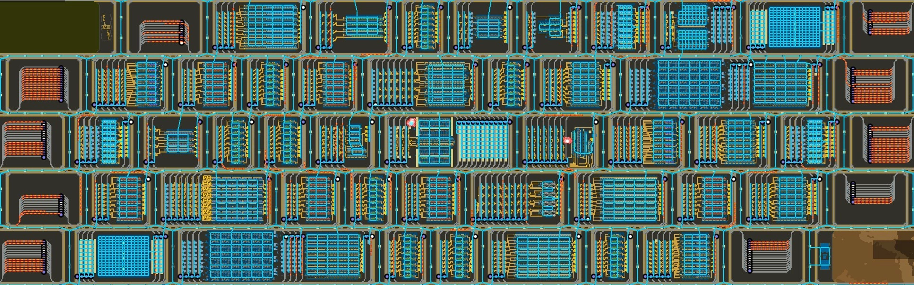

---
## Introduction

### Design and Name

The particulars of any megabase are as much about the challenges, constraints, and goals that one finds personally interesting as they are about those set by the game itself. In my case, I found myself particularly interested in eight-beacon designs. The challenge of minimizing the space needed for a given level of output, and mastering the variety of belt and inserter techniques required to do so, simply scratched the right itch in my brain - so much so that I decided to extend that philosophy to the rail system that would comprise the base itself.

The general design language I settled on is thus one where each train _wagon_ provides ingredients to, or takes ingredients from, a single independent eight-beacon production row. In theory, no balancing of ingredients between rows is needed, because each row should consume and produce at the same rate, and so each wagon in a train should always contain the same item quantity. This philosophy enables a variable-length block design where a near-arbitrary number of input trains can unload parallel to each other, route their ingredients perpendicular to the trains themselves, and merge into the precise belts that are ultimately needed. Eight-wagon trains feeding (typically) eight production rows per block proved an ideal balance between throughput and compactness.

This [SIMD](https://en.wikipedia.org/wiki/Single_instruction,_multiple_data)-like design pattern, plus the heavy use of eight-wagon trains, eight-beacon rows, and eight-row blocks, ultimately led me to the name. ILLIAC was a limited series of very early supercomputers designed and built primarily at my alma mater of UIUC. The [groundbreaking (though ill-fated) ILLIAC IV](https://en.wikipedia.org/wiki/ILLIAC_IV) in particular is [widely recognized as the first computer to utilize SIMD parallelism,](https://en.wikipedia.org/wiki/Single_instruction,_multiple_data#History) so it seemed fitting to dedicate this base in that tradition.

### Settings and Mods

This game was played from scratch on a vanilla, default settings world. Resource patches were not spawned in, resource richness was not increased, and biters remain on (see the next section for performance notes). While I do not begrudge those who would rather bend the map entirely to their will and focus solely on unconstrained design exercises, I personally believe that's what a sandbox save is for, and that a fairer test of skill includes contact with the real world (such as it is). The one exception I made to default settings was disabling cliffs, as I personally find them a nuisance rather than a challenge.

No console commands were run, except to remove two small resource patches in the main base, as they interfered with the aesthetics of the concrete.

The following quality-of-life mods were used:
- [Auto Deconstruct](https://mods.factorio.com/mod/AutoDeconstruct) marks miners for deletion when they run out of resources. Much more visible than the tiny red light in the pre-bot early game, and allows bots to automatically maintain remote outposts in the later game. Every mining outpost in this base has a bot network covering the patch, along with one unfiltered storage chest and at least one construction bot, for storage of miners whose resources have been exhausted.
- [Bottleneck Lite](https://mods.factorio.com/mod/BottleneckLite) puts a small visual indicator on every crafting entity signaling whether it is working (green), hobbled for any reason (yellow), or stopped (red). Extremely useful for at-a-glance debugging of throughput issues.
- [Editor Extensions](https://mods.factorio.com/mod/EditorExtensions) was not used in this save directly, but provided many useful tools for the separate sandbox save in which most of ILLIAC VIII's builds were initially designed.
- [Even Distribution](https://mods.factorio.com/mod/even-distribution) allows the player to manually distribute ingredients across compatible entities in uniform quantities. Extremely handy for spreading ammo across early-game turret boxes, and for easier manual balancing of ingredients. 
- [Far Reach](https://mods.factorio.com/mod/far-reach), because _why can't I interact with that thing when it's **RIGHT THERE??**_
- [Power Grid Comb](https://mods.factorio.com/mod/power-grid-comb) makes wires prettier with a simple click and drag. It's not perfect, but it's a lot better than doing everything by hand.
- [Rate Calculator](https://mods.factorio.com/mod/RateCalculator) is, in my opinion, the absolute best QoL mod out there: Click and drag over a set of machines and get a pop-up box with all their rates and ratios. Removes almost all of the tedious manual math involved in precise recipe chains, and a lifesaver when modules enter the picture.
- [Realistic Decoration Cleanup](https://mods.factorio.com/mod/RealisticDecorationCleanup) clears decorative sprites when placing entities. Grasses and such that peek out from the cracks between concrete tiles are a blight on a well-paved base.
- [Spidertron Bob Speed](https://mods.factorio.com/mod/spidertron-bob-speed) removes (most of) the inebriated wobbling when a spidertron stops moving. Placing entities or distributing items in a straight line while riding a spidertron is annoyingly inaccurate without this.
- [Spidertron Enhancements](https://mods.factorio.com/mod/SpidertronEnhancements) has many niceties, but I installed it purely so spidertron inventory would be automatically sorted like the player's. Deconstructing an outpost with spidertrons in the base game often clogs their inventories because items randomly get split into multiple partial stacks, which I honestly believed to be a bug when I first noticed it. (I still don't understand why it isn't considered such, but [that's the official word.](https://forums.factorio.com/viewtopic.php?t=99737))
- [Squeak Through](https://mods.factorio.com/mod/Squeak%20Through) is one of the most popular QoL mods, and for good reason; while it's understandably "realistic" that players shouldn't be able to walk through pipes and such, that doesn't make it any less infuriating. It is possible that some of my rail-adjacent blueprints may not be placeable without this installed (rail curve interference is defined by the entity bounding boxes that this mod alters), but to be perfectly honest I don't really care.
- [Waterfill](https://mods.factorio.com/mod/Waterfill_v17) arguably goes a bit beyond pure QoL, but the sole reason I installed it was because I resent 1.1’s inability to remove landfill. Although I ultimately did use it to create water where none existed in one or two places, the vast majority of water-consuming builds were legitimately pasted over landfilled lakes.
- [Zooming Reinvented](https://mods.factorio.com/mod/Kux-Zooming) makes zooming behavior tolerable on an ultrawide screen.

### Performance

Runtime performance, while important for obvious reasons, was secondary to design concerns. A number of "suboptimal" (from a pure UPS perspective) design decisions were deliberately made:

- Mining is bot-based rather than direct-to-train or direct-to-furnace
- Except for smelters, inserters are not [clocked.](https://www.youtube.com/watch?v=FLb8TJ6-Z2M&t=1622s) I did try to integrate clocking into the main base, but due to a variety of factors mostly involving assemblers' low internal output buffers, it never produced _completely_ consistent results. I believe this is only a reliable technique for direct insertion builds
- The vast majority of non-smelting production adheres to the standard 8-beacon design language rather than 12
- Basic oil processing is not used for petroleum production
- The majority of power comes from nuclear rather than pure solar
- Lights are included basically everywhere
- Biters remain on

This results in a typical UPS/framerate in the low to mid-30s, as played on a fairly capable system (5800X3D + 32GB DDR4-3600 CL16).

Biters contribute by far the most significant amount of unnecessary lag, by roughly an order of magnitude. I experimented with pushing defenses past the pollution cloud by [nuking landfill](https://www.reddit.com/r/factorio/comments/lvtwh3/psa_use_nuclear_weapons_on_landfill_to_reduce/) and artillery outpost creep on a duplicate save, which eventually addressed the issue, but the process was incredibly tedious and the results were surprisingly underwhelming (CPU time saved by eliminating biters was partially counterbalanced with time spent monitoring more turrets and trains on a larger map). So instead of publishing that save, I have published the alternate save game "ILLIAC VIII No Biters," which is identical to the default save except with the following console commands having been run:

- Delete biters on revealed chunks: `/c local surface=game.player.surface for key, entity in pairs(surface.find_entities_filtered({force="enemy"})) do entity.destroy() end`
- Remove unrevealed chunks (i.e. those with generated but undiscovered nests): `/c local surface = game.player.surface local force = game.player.force for chunk in surface.get_chunks() do if not force.is_chunk_charted(surface, chunk) then surface.delete_chunk(chunk) end end`
- Prevent biters from spawning on newly generated chunks: `/c local surface = game.player.surface local mgs = surface.map_gen_settings mgs.autoplace_controls["enemy-base"].size = "none" surface.map_gen_settings = mgs`
- Disable pollution: `/c for _, surface in pairs(game.surfaces) do surface.clear_pollution() end game.map_settings.pollution.enabled = false`

This alone bumps the UPS/framerate back up to a perfect 60 with a bit of headroom to spare (on the same computer, assuming it's otherwise unoccupied). For this reason, I recommend touring the No Biters save unless you just really want to see the local wildlife get what’s coming to them. 

## Rail and Robot Networks

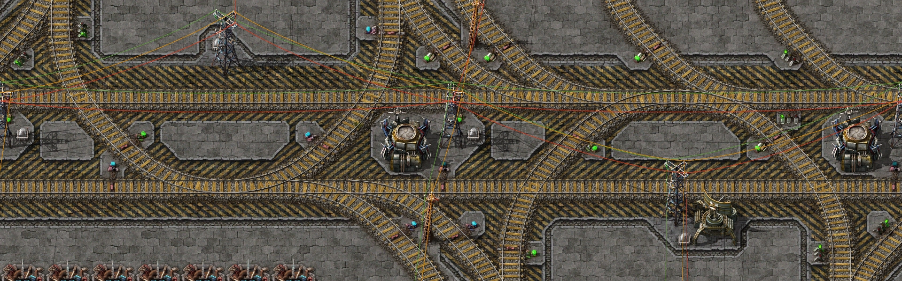

Both 1-8-1 trains (one lead locomotive, eight wagons, one trailing locomotive) and eight rows of eight-beacon builds can comfortably fit in a standard 100 tile block height, so that seemed an easy choice. Width was less obvious, as modularity dictated that it needed to be variable but not infinitely so. Segments of 30 tiles ultimately proved best:

- It's exactly the length of big power pole wire reach (as of game version 1.1), so power is easy to route between blocks
- One underground blue belt pair (including the belts themselves) spans 10 tiles, which then incentivized parallel train stations to be placed every 10 tiles, resulting in exactly three train stations per segment
- A full 180-degree rail curve can fit in this width with a bit of room to spare, which allowed for spread-out three-way intersections to be placed between blocks in roughly the width of a full segment. The extra width compared to a more traditionally compact three-way intersection has its benefits:
    - Trains can make U-turns without needing to go around entire blocks
	- The policy for block interleaving becomes obvious (the ends of each block should be offset at least one full segment from the ends of blocks above and below, so U-turns don't overlap)
    - Extra space gives clean visual separation between otherwise extremely compact blocks
    - The player has a bit of breathing room to traverse on foot within the base in at least _one_ dimension without much risk of getting run over!

The next goal was to maximize buildable area within each block, which required running as much infrastructure as possible between blocks rather than inside them. Left-hand-drive train orientation allows for signals to be placed in the inter-block space, and a standard 4-tile spacing between horizontal passing rails avoids conflicts between signals and power. The remaining 92 tiles of vertical space is precisely enough room for four big power poles, inclusive of the poles themselves; power is therefore connected vertically between blocks. Radars are then placed next to the topmost of these vertical poles, providing base-wide map visibility.

This rail spacing also allows for roboports to be placed between rails, so the backbone of the main base's robot network is formed by roboports placed next to each power pole along horizontal rails; these are then connected vertically by an additional pair of roboports next to the center two power poles along vertical rails. This roboport spacing provides sufficient logistics range to reach parked locomotives, allowing for bot-based refueling within the main base and avoiding the need for a fuel train entirely. (ILLIAC VIII has no dedicated ore trains, so even the furthest-reaching trains will at worst make round trips to the base and back; each train thus has at least one guaranteed refueling opportunity per round trip).

Because there is not enough space by the vertex of a U-turn to place a power pole in the exact center and still fit a roboport next to it, poles are instead placed at the edges of segments, aligned to either side of U-turns. Each has an electrical connection to the nearest vertical pole in the center segment, but NOT to each other, creating electrical zig-zags around U-turns. While this was an annoying requirement to maintain, there does exist an edge case where two center segments that touch at their lower-right and upper-left corners could otherwise exceed the maximum 5 connections for a big power pole, as the pole in the middle would be tasked with one connection to a load station, one to an unload station, and four to neighboring big power poles; removing the unnecessary horizontal electrical connections here avoid this issue. (See the pole at the center of this section's lead screenshot as an example of such a four-connection setup).

The wider rail network that extends beyond the main base follows this same 100x30 grid pattern. Unlike the main base, the wider network does not include roboports or radars by default (there are few benefits and many drawbacks), and allows for "extensions" (long, uninterrupted shots of rail, either vertical or horizontal).

## Train Stations

### Station Circuit Control

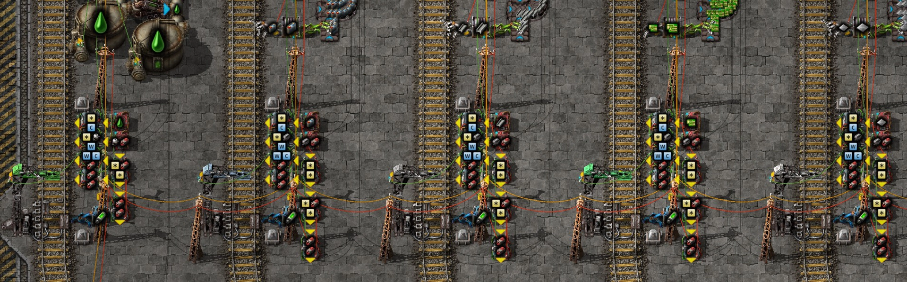

To promote blueprint reuse across a wide range of scenarios, train station circuitry is designed for greater flexibility and ease of use than I typically take full advantage of in this base. The core principle is that all necessary configuration and functionality (aside from the stop name, which cannot be circuit-controlled) should be handled simply by setting constant combinators. One combinator sets the type of item(s) or fluid that the train carries, with a value of the stack size for solid items or 1 for fluids; the second combinator uses the wagon signal to set the number of wagons per train, and the locomotive signal to set the maximum train limit. For all basic load and unload stations within the main base of ILLIAC VIII, the train limit is set to 1, as there is simply no room in a SIMD block design for traditional stackers; queues for raw ingredient trains are instead handled with dedicated stacker stations (see [Stackers](#Stackers) section for more detail).

Load stations first use the stack size and number of wagons to calculate the size of a train load, then compare that to the item or fluid count in storage to determine the available number of train loads that can be picked up. This train load count is used for two purposes. First, the count is compared to the maximum train limit (as defined by the locomotive signal in the constant combinator), and the station's train limit is set to whichever value is lower. Second, the train load count is separately transformed into the carried item or fluid type signal and then sent to the global circuit network on the green wire, providing per-item monitoring of the number of available train loads across the entire base (see [Monitoring and Clocking](<#Monitoring and Clocking>) section for more detail).

Unload stations also use the stack size and number of wagons to calculate the size of a train load, then compare that to the item or fluid count in storage to determine the available number of train loads that are _already present_; this is then subtracted from the maximum train limit to calculate the actual train limit. In effect, this requires a number of train loads equivalent to the maximum train limit to be kept in the storage buffer at all times, and calls trains until that buffer size is exceeded. The inverse of the calculated train limit is also transformed to the carried item or fluid type signal and then sent to the global circuit network on the red wire, providing per-item monitoring of the number of requested train loads across the entire base. In case of emergencies, the red color signal icon is triggered as a global alert if the storage buffer ever runs totally empty (for solid items) or dips below 1% of a train load (for fluids).

Bot unload stations used in the primary mall have reduced circuit functionality, since malls do not require constant production and thus do not benefit from constant maintenance of an item buffer. Instead, a single constant combinator denotes the carried item type, but set to the default constant signal value of 1 rather than specifying the stack size. A mall station only calls a train when its storage buffer is _completely_ empty. The remaining combinators are used to send load demand information over the global red wire, just as with normal unload stations. This leaner arrangement allows for a complete bot-based unloading system in only two tiles of width, allowing for very tight station and roboport packing and a corresponding reduction in bot travel time.

For solid ingredient stations, the combinator-specified carried item type is additionally used to set filters on filter stack inserters, preventing accidental item contamination from any configuration mishaps.

### Solid Ingredient Stations

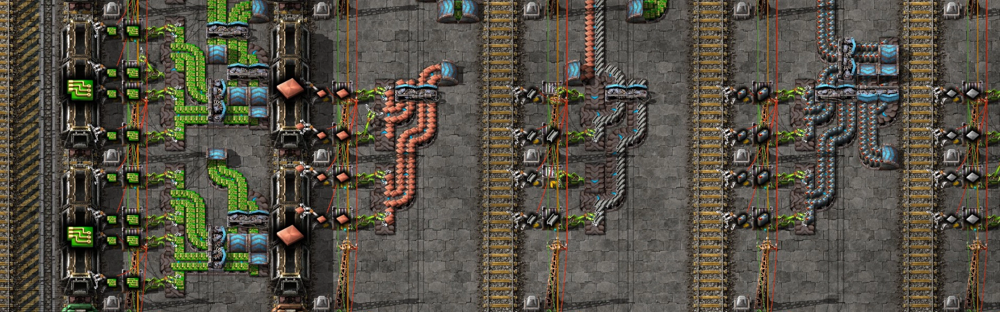

The core load station design is quite simple. Wagons are fed by six stack filter inserters drawing from a buffer of six steel chests; those chests are themselves fed by six stack inserters (no filter needed here, as we can assume contamination directly from the production source is impossible) drawing from a 1-6 balancer that ensures even distribution between chests and thus fastest possible loading times. Each stack filter inserter and steel chest are connected to circuit control with their own dedicated wire reaching to the nearest medium power pole, which allows deviations from the standard design by simply deleting inserters and their corresponding chests, without requiring any re-wiring of neighboring inserters or chests. The most common deviation is a reduction of 1-6 to 1-4, used primarily in cases where there is simply no room in a block to fit a 1-6 balancer (e.g. blue circuits), or when an item's buffer size can simply be smaller (e.g. uranium processing).

Unload stations require a bit more flexibility. The same stack filter inserter-steel chest-stack inserter design remains (with the filter inserters still track-side), but the second and fifth groups have been removed, leaving two inserter-chest-inserter pairs per wagon. This enables a well-known belt unloading arrangement where each pair unloads its contents onto one-tile-long belts, immediately sideload onto shared belts, and finally join with a splitter, producing one consistently full blue belt of output per wagon.

A few ingredients that craft very quickly compared to their demand use a single block with only four production rows, necessitating a solution where a belt's contents are drawn evenly from two wagons at once. While this could be done simply by joining the ordinary belt output from two wagons with a splitter, a simpler solution is to keep only the fourth and sixth-positioned chests of one wagon plus the first and third-positioned chests of its neighboring wagon, and then join them as before; this uses much less space and makes the conjoined nature of the setup more visually obvious. (In a small number of cases where only two production lanes are used in a block, splitters are used to join the outputs of this leaner solution).

In cases where _more than one full blue lane_ (> 22.5/s) of an ingredient is required per production row, that ingredient's output belt will typically be lane balanced, usually by using the first splitter as the entry point to a right-angled 1-1 lane balancer. This mitigates the risk of the combined contents of the first and third chests (which feed one lane of normal output) gradually becoming unbalanced compared to the combined contents of the second and fourth chests (which feed the other lane). Such an imbalance, once large enough, would eventually cause one lane to be starved of items while the other still contained enough of a buffer to present to circuit control as if the station was full, thus causing a silent production bottleneck. Owing to nuances of splitter mechanics, overproduction causing stops and starts, etc., this is still not a perfect solution, so input chests can still gradually become unbalanced - but they do so on the order of ~200 hours instead of ~2, so I am comfortable in calling that good enough.

Alternatively, where _one full blue lane or less_ (<= 22.5/s) is required per production row, lane balancing is not used, since one lane being completely starved is acceptable as long as the other is saturated, and thus any two chests containing items will provide sufficient throughput to sustain full production.

In extreme cases, where demand for an item is high compared to its stack size, a single train station simply isn't sufficient to keep up with demand. Raising the item buffer to two train loads' worth via circuitry solves the problem when stack size is at least middling (e.g. copper plates for low density structures), but for items with very low stack sizes (e.g. low density structures themselves), even that is not enough to guarantee that intermediate trains will arrive quickly and consistently enough to keep the station buffers full. To combat these scenarios, stations can be "chained" - essentially, using priority input splitters to merge the output of wagons from one station with the output of corresponding wagons from a neighboring station. This allows an arbitrary number of trains to feed a single production lane, effectively multiplying train availability for throughput-sensitive stops.

### Fluid Stations

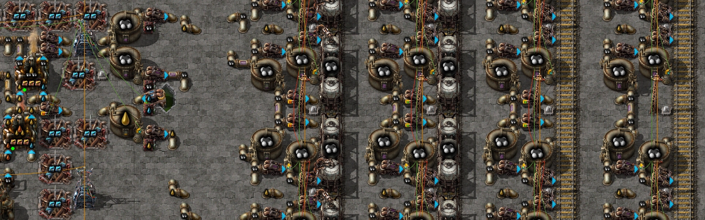

Because Factorio models an approximation of fluid pressure, draining a tank (or fluid wagon) is very fast when it is full, but becomes progressively slower as the fluid level decreases. So ideal fluid loading requires not only that each tank feeding a fluid wagon starts full, but also that that tank is itself being fed by _another_ tank, so as to keep the total fluid level relatively high while it is still being drained. The pursuit of [maximum fluid throughput](https://wiki.factorio.com/Fluid_system#Pipelines) would lead to a tank-pump-tank-pump-wagon design, but ILLIAC VIII's block layout forces a more space-conscious approach. Thankfully, adding a single pipe to create a quick right turn from each tank is nearly as fast while requiring only 3 tiles of width per tank-pump stage.

The basic fluid loading station thus uses a two-stage design. The first-stage tanks are all connected to each other, allowing passive balancing of fluids which may have any number of inputs at any location, each flowing at an arbitrary rate. (This is especially the case for crude oil patches). Because temporary imbalances are expected, it is thus possible for a station to contain enough fluid to fill a train while that fluid is concentrated at the front or rear, which would allow trains to be called and then stall them while the system balanced itself enough to fill the train. To mitigate this, the second-stage tanks are dedicated for each wagon (no passive balancing between tanks), and only these tanks have their contents monitored. This ensures a train will only be called when each individual second-stage tank can fill its corresponding fluid wagon.

Fluid unloading stations are essentially the same design positioned and run in reverse. Wagons drain into a shared first stage, which then immediately pumps into individual second-stage tanks. The second-stage tanks are dedicated by default, to guarantee stable supply for each of eight production rows (e.g. plastic), but they may be connected in cases with fewer than eight production rows and/or where fluid demand is very low. All tanks from both stages have their contents monitored in unload stations, since they are (almost!) only used in production blocks, and thus stronger assumptions can be made about expected balance across the system.

As with certain solid ingredients, the extremely high fluid throughput of oil and petroleum in particular necessitates "chaining" multiple stations - but this is not as easy in fluid systems as setting a simple splitter priority. Chained load stations enable pumping out of one station's first stage into the next station's first stage, only if that first station's _second_-stage tanks are >=99% full. In other words, each chained load station will first build up one train's worth of fluid for itself, and only then allow excess to feed forward into the next station. This ensures each station can only dip below one train's worth of fluid by actually calling and loading a train. Without this safeguard, trains could be called and then stranded in flight, as the contents of a "full" station could be prematurely drained into the next.

Chained unload stations are again essentially the same design run in reverse: pumping is enabled _into_ each station's _second_ stage from the _previous_ station's second stage, only if that station's total contents are <45% full. (This is equivalent to <90% full in the second stage, adjusted to account for both stages' contents being monitored.) Extra margin of error is necessary because turning all chain pumps on, even for a single tick, can move enough fluid into the system to cause the station to register as full again. This safeguard ensures that an "empty" unload station (<198k fluid) will remain empty until a train arrives to refill it, avoiding the same train stranding problem as with chained load stations, while still pushing fluid forward through the system from second stage to second stage.

The final variety of fluid station is reserved for single input/single output scenarios, such as lubricant production from coal liquefaction. In these cases, the stage connected to the production input or output (first stage for load stations, second stage for unload stations) is divided into pairs of tanks and separated by circuit-controlled pumps. Each pair has its contents monitored using the red wire (separately from the whole), and the pumps between pairs are only activated when neighboring pairs' contents are imbalanced. This essentially replaces the passive balancing of other fluid stations with an active balancing system, which is more important to explicitly enforce when the natural flow of fluid would otherwise be extremely imbalanced.

Note that most of these nuances will become entirely unnecessary upon the impending release of 2.0, owing to [a significant change in fluid system mechanics.](https://factorio.com/blog/post/fff-416)

### Stackers

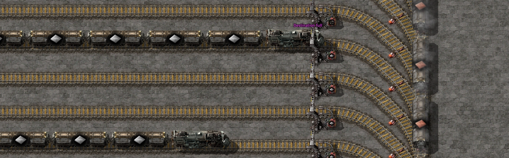

Because of the inherent compactness of the core block design, there is no room in the blocks themselves for train queues (commonly "stackers"). This is an acceptable omission for intermediate ingredients, as the compactness also implies relatively short train travel time within the main base, so the delay between a station opening in one block and a train arriving from another block is typically fairly short. (Again, in cases where even internal congestion risks being too great an obstacle, chained unload stations or larger item buffers make up the difference, depending on the specific ingredient). However, this does not solve the problem for "raw" ingredients, which must travel from quite far-flung remote outposts. If raw ingredient trains were only called when they were needed, compensating for the travel latency would require the number of chained unload stations or size of item buffers (or both!) to grow to unacceptable sizes, and thus undermine the design of the blocks themselves.

The solution was to introduce entirely separate stacker stations, placed at the outer edges of the main base. After filling up with material from remote outposts, each raw ingredient train does not go directly to an unload station, but instead to an ingredient-specific stacker station, where it then waits until an unload station opens up. Each stacker station has a limit of 1, but is always open with no circuit controls.

For each of the five rows of blocks in the base, the stacker configuration was determined using a combination of two proxy estimates for that row's peak raw ingredient demand: first, the number of average train loads per ingredient per minute consumed by all non-mall blocks in the row (as determined by simply dragging the Rate Calculator tool over the relevant blocks and dividing each raw ingredient by its eight-wagon capacity), and second, the number of non-mall train stations for that ingredient. The exact formula used to determine the number of stacker stations per ingredient per row was `ceiling(avg(ceiling(loads/minute), number of non-mall stations))`. They were then sorted first by number of non-mall stations and second by loads/minute, where higher rank positioned them closer to the stacker blocks' entrance and exit. (This positioning minutia does not matter in any practical sense, except that I had to sort them _somehow_). Each row's stacker configuration was mirrored on both edges, both to reduce the maximum distance between any given stacker and its likely unload stations, and also to dissuade raw ingredient trains from ever navigating _through_ the base to reach a stacker station, which would cause significant and unnecessary congestion.

## Power

I had initially intended to exclusively use nuclear power, but I had yet to get the achievement for placing 10GW of solar, since that essentially requires megabase production levels. It seemed silly to place that much solar power only to tear it down again, so I opted for a mix of solar and nuclear, with the latter bearing the brunt of the ~38.4 GW average power draw.

### Solar

~10.5 MW * 1,745

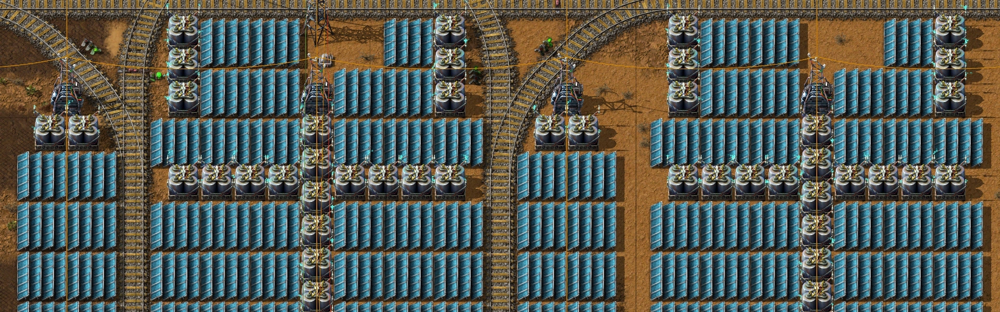

Rather than attempt to negotiate space between solar fields and the rail network, I instead shaped this solar array design to allow any arrangement of the rail network to be run _through_ it. This takes more surface area than a traditional solar array would, but the _usable_ space on the map is much higher, since it essentially eliminates conflict between solar and rail placement.

Each solar block consists of a center "body" designed to fit inside a U-turn rail segment, plus two "wings" on either side. The body is accumulator-heavy and the wings are solar-heavy, but one body and one wing contain a total of 146 accumulators and 175 solar panels - an 83.43% ratio, compared to the perfect target of 84%. Because wings overlap when tiling, a long horizontally tiled row will approach this ideal ratio.

### Nuclear

1.886 GW net * 14

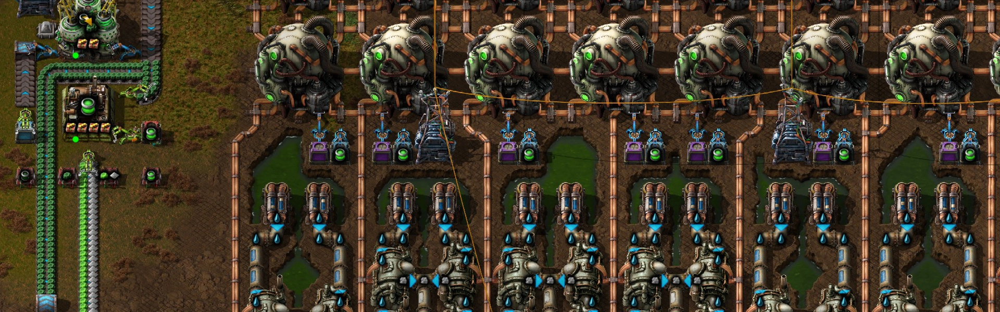

Yeah, it's not optimal for game performance, but I spent literal days perfecting this reactor design, and I am _not_ letting that effort languish in a blueprint book!

The goal of this design was an "ultimate" reactor of sorts:

- Compatible with both this base's rail network and [standard 100x100 city blocks](https://www.youtube.com/watch?v=FPJWak8z_nE&t=113s)
- Infinitely tileable (within obvious reason)
- Maximum neighbor sharing (i.e. tiling should result in a gapless 2xN array of reactors)
- Can be pasted directly over lakes
- Bot-fed
- Self-building

However, I chose not to include two common features in other knowledgeably-designed reactors:

- Circuit-controlled fuel cell insertion, because uranium is incredibly cheap
- Steam tanks, because if you can afford to make all the extra turbines needed to take advantage of excess steam supply during power spikes, you can afford to just make a bigger reactor

The first and most fundamental decision to make was the tileable width. The heat exchanger stage is maximally compact when laid out in a heat pipe-exchanger-steam pipe-exchanger-heat pipe pattern, which repeats every 6 tiles (allowing the heat pipes at the ends to overlap). Since reactors are 5x5 and turbines are 3x5, this results in a least common multiple of 30, allowing for a tileable pattern containing exactly six reactors, five double-exchanger rows, and ten turbine rows. Happily, 30 is also the maximum reach of a big power pole and the width of this base's rail block segments, allowing for truly perfect placement within the rail system. For those using standard city blocks, this also allows exactly three copies of this reactor design to be placed across three consecutive city blocks with space left over for the footpaths.

Twelve reactors with maximum neighbor bonuses put out 160 MW of heat each, requiring 192 heat exchangers. Since there is space for a total of twenty rows of heat exchangers (five double-exchanger groups on each side of the reactors), the obvious solution was to make the default row ten heat exchangers long for a total of 200, then remove the four unnecessary exchangers on each side to make room for a roboport in the middle. These roboports are spaced the maximum 50 tiles apart at their centers to create a contiguous logistics network, and wire reach is just long enough from the roboports' big power pole to the substations bordering the reactors to also create an internally contiguous electrical network. (A few tileable reactor designs I've seen have separate electrical networks on each side that require manually bridging at one end, which I wanted to avoid). Each row of heat exchangers is given a dedicated offshore pump, placed as close to the reactors as possible to minimize the lake surface area the build needs to be pasted over.

Each group of twenty heat exchangers can theoretically push 2,062/s steam through a single pipe, which is [about as deep into the realm of 1.1's fluid throughput limitations as one can get](https://wiki.factorio.com/Fluid_system#Pipelines) (even the less exchanger-dense center row can produce 1,649/s steam, which still requires careful assistance). Pumps have thus been strategically placed near the ends of the steam pipes to maintain flow. These pumps are powered by substations that can just reach the roboports' big power pole, extending the internally contiguous electrical network.

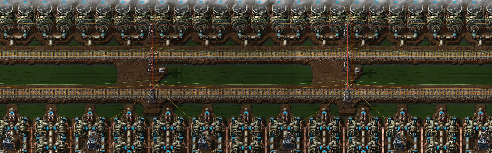

It is at this point that the design hits the edge of one rail and/or city block, with the output pipes of the endmost steam pumps reaching a total build length of 90 tiles out of the 92 allowable to maintain block compatibility. So the steam pipes must here be routed underground to allow rails and/or a footpath to pass between these stages of the reactor and the final turbine stage. The electrical connection between the two sides is bridged with city block-standard big power poles on each side, complete with their usual signal wires attached; while this is unnecessary for my particular base, it doesn't _hurt_ anything, and it makes city block integration seamless.

After crossing to the far side, each steam pipe immediately splits into two, avoiding further flow rate issues by sending ~half the total steam each down two separate paths. These then turn into dedicated rows of turbines that run the entire remaining buildable length. Substations are interwoven every three turbines, with the gap simply being bridged by pipes. The center turbine group is less capable (like its corresponding heat exchanger group), but still makes use of its free space: Roboports are added at perfect 50 tile intervals, and because the self-building requirement also necessitates map visibility, each side places a radar by the nearer roboport, with the two radars thus being separated by just under the maximum distance needed to maintain contiguous coverage regardless of their [chunk alignment.](https://wiki.factorio.com/Radar#Nearby_Pulse_Scanning) One additional turbine is squeezed in sideways by the final roboport and connected to the rest of the group with a pipe that runs around its side.

The result is that the four major heat exchanger groups which can produce 2,062/s steam each feed into a group of 34 turbines which can consume 2,040/s, while the center heat exchanger group which can produce 1,649/s steam feeds into a group of 29 turbines which can consume 1,740/s. While this is technically a sufficient total number of turbines to consume the total amount of generated steam, the distribution is slightly inefficient. This is partially mitigated by utilizing the one remaining tile of space in the center turbine group about halfway down (where flow rate is low enough to make throughput irrelevant) to add an underground pipe connection to the two neighboring groups, which allows the ~22/s excess steam from each neighboring group to spill over into the middle group. Sadly, I could not find room to add a similar spillover connection to the two outer groups.

One might quite reasonably ask why the steam pipes are not bridged right at the start of the turbine stage, to create a single shared steam pipe and allow excess steam to migrate to the center turbine group immediately, so as to not have to create such odd pipe connections in the middle of the turbine stage. The answer is that I tried that, and discovered an extremely odd and frustrating quirk of 1.1's fluid system. In a shared steam pipe configuration, it is possible for several of the most heavily loaded pumps on the reactor side to essentially become crippled - capping their maximum steam output at hundreds of units per second lower than the split configuration. The cause is tied to the reactor's construction rather than its design; depending on the specific order of pipe junction creation, the problem will affect the reactor either permanently or not at all. After spending well over a full day of my life debugging this issue, I could not find a way to circumvent it, and I finally decided to cut my losses. So, rather than accept a shared steam pipe design that risks operating well under capacity due to reasons that are entirely outside player control, I instead opted for the split design with its small but consistent inefficiency. (This is another issue that will be eliminated in [2.0's fluid rework,](https://factorio.com/blog/post/fff-416) which I am _extremely_ happy about).

Both full reactor builds on the map are topped off with a set of iron and uranium train stations that feed a local fuel cell and reprocessing build, each capable of sustaining up to 140 individual reactors. The one noteworthy feature is a deliberate terminating curve in the U-238 belt feeding the fuel cell assembler. Because the centrifuges drop reprocessed U-238 onto the far lane of the forward-facing belt, and the U-238 from the train station is sideloaded onto the near lane of that same belt, the fuel cell assembler's U-238 input would ordinarily prioritize the near lane, causing the centrifuges to choke on their own U-238 output. However, by introducing a belt curve facing this inserter, it prioritizes the outside (far) lane instead, neatly avoiding this problem.

### Steam Power

32.781 MW net * 6

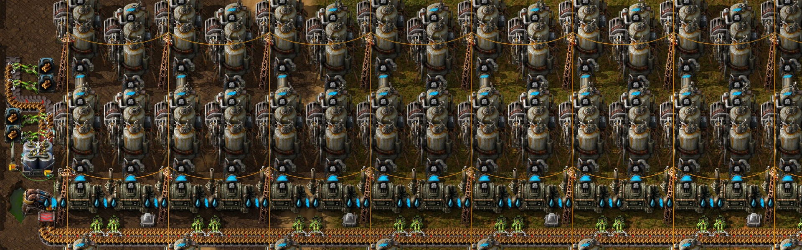

This simple backup steam power design is intended primarily as a wood sink, but it also served as a valuable insurance policy while I was building out the solar fields. Each unit triggers a global alert and turns on its offshore pump only when global accumulator charge dips below 10%.

## Defenses

### Perimeter

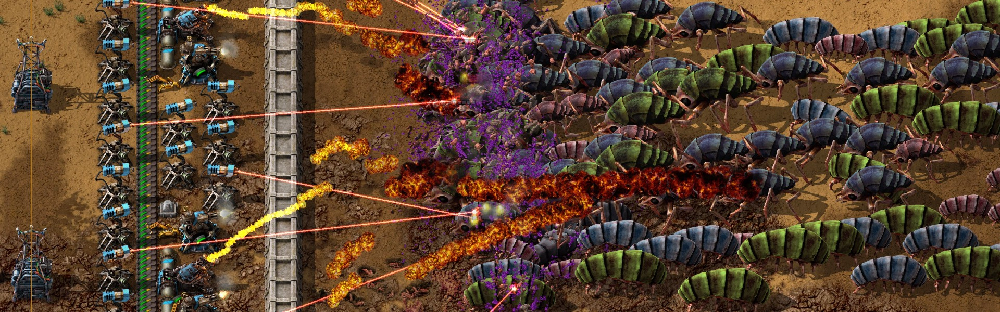

Rather than being enclosed by one continuous wall, ILLIAC VIII is protected by discrete sections of wall that stretch the full length between the nearest two lakes. Each section is paired with a dedicated train station.

The turret pattern is a fairly simple repetition of gun turret-flamethrower-gun turret-5x laser turrets, backed by an ammunition belt and an additional row of laser turrets. A double-wide wall is more than sufficient to protect this turret configuration, even without any infinite damage upgrades (which I also have a few of) or [dragon's teeth.](https://www.youtube.com/watch?v=hM2YThrpq0U) However, it still includes a final insurance policy in the form of power pole redundancy: substations are placed every nine tiles instead of every eighteen, so the loss of any one substation will not take down the lasers or the ammunition inserters.

A line of roboports at least every fifty tiles allows for automatic bot maintenance, and radars roughly every 200 tiles allows full remote visibility for emergencies (and schadenfreude). Bot-fed artillery turrets with several range upgrades are occasionally sprinkled in to create a buffer zone, deal with behemoth worms that would otherwise outrange turrets, and neutralize [expansions.](https://wiki.factorio.com/Enemies#Expansions)

For ease of construction, blueprints are included for inner and outer corners, as well as for a straight section modified to include magazine and oil inputs.

### Train Stations

Like any good defense train station, this is designed to automatically build and maintain its corresponding perimeter section, monitor its own item levels, and call trains when in need of resupply. This particular design isn't terribly clean and would benefit from another revision, but it honestly wouldn't be worth the effort. However, it does have some noteworthy tricks up its sleeve.

Items are unloaded from trains into buffer chests so they can be both drawn from and deposited into by bots. This is primarily useful for the artillery and magazine chests, which are filtered so that any ammunition that ends up being returned to the storage network (typically when manually editing the wall) are returned to the relevant ammunition feed, instead of potentially languishing uselessly in an unrelated chest. Because buffer chests can only be filtered to one item type, this feature does not extend to other items, which introduced the possibility that wall materials could be returned to a different chest and throw off the resupply monitoring. Rather than wire up every chest to the supply combinators, items are instead tracked by monitoring logistics network contents via the rear roboport and forwarded along the green wire.

Constant combinators are used both to define total desired item quantities (via the red wire), but also to set filters on the neighboring filter stack inserters (via short-distance green wire). Actual item quantities are inverted via the arithmetic combinator next to the pump and then _also_ connected to the filter stack inserters. The sum of these two signals provides each inserter with a positive signal (active filter) for the whitelist of items set by its neighboring constant combinator, which decreases and is eventually overwhelmed (removing the filter) as the available supply of those items rises and exceeds the specified quantities. This keeps items in storage at reasonable levels, while also allowing each inserter to move specific sets of items from mixed wagons - preventing e.g. laser turrets from being placed on the magazine belt.

To prevent a great deal of unnecessary defense train trips, trains are only called when supply of any item falls below 1/3 of its desired quantity. This is handled by the (overcomplicated) secondary set of combinators nearer the train station, which morphs the available item signals similarly to the inserters while applying that coefficient.

The rail design can be rotated and pasted over any horizontal section of track, providing a U-turn and unload area separated from the mainline while still allowing through traffic. This greatly simplifies border expansion, as it is not necessary to manually connect the station to a loop to allow trains to return, and further extensions can still branch off from the same section of track. A few laser turrets are scattered around non-conflicting areas to offer a modicum of protection to the station while under construction, since biters aren't guaranteed to attack from the front while a perimeter is still being established.

For situations or playthroughs where artillery outpost/"pillbox" expansion is preferred (typically when aiming to push artillery coverage past the pollution cloud, thus avoiding the need for a full border), this station design has also been modified to fit in vertically- and horizontally-oriented versions of a self-contained outpost. Both versions are surrounded on all sides by a slight variation of the defense perimeter design, and are what I used to expand past the pollution cloud in an experimental save (see [Performance](<#Performance>) section for more detail). They are available in my blueprint book.

### Trains

The defense trains themselves are quite simple. Each stores its solid (non-artillery) cargo in mixed and filtered cargo wagons, which contain all items necessary to build and arm a reasonably large stretch of defense perimeter. The schedule simply rotates through the solid cargo load station at the defense mall, the light oil load station, and then an open perimeter unload station before repeating. In each case, the exit condition is simply "inactivity," rather than a more complicated tracking of supplies of individual items; this is feasible because the filter mechanics of the perimeter station automatically stop unloading items when their respective supply thresholds are reached.

## Mining, Smelting, and Processing

### Stone and Coal Mining

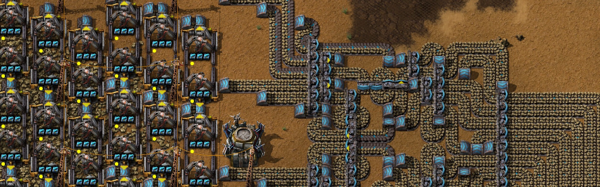

Stone and coal mining arrays remain the closest to a traditional design, due to the lack of need for any smelting or processing step. To maximize the number of belts that can be drawn from a single patch, a pattern is used consisting of three pairs of miners offset from each other by one tile. This allows weaving of output belts underneath neighboring miners, and results in an effective three blue belts of output every seven tiles of width. Speed modules and a high mining productivity research level guarantee that the belts will be filled.

To promote full throughput even if the patch is partially depleted, and to ensure each train wagon has access to an equal amount of items, reducing balancers are placed at the output. Most commonly, a semi-custom 12-8 balancer is used to directly convert the output of four groups of three-belt miner rows into an even eight belts, one for each train wagon. I was unable to find a premade 12-8 balancer, so I made one by bolting two of [Raynquist's](https://github.com/raynquist/balancer) 6-4 balancers together and joining their output (meaning each output belt from one 6-4 balancer is joined with a splitter to an output belt from the other 6-4 balancer). Underground inputs are included in the blueprint, offset to overlap at the exact locations of the miner groups' output undergrounds. There is almost certainly a simpler and smaller equivalent of this balancer, but physical compactness is rarely if ever helpful for remote outposts, so design speed and setup speed were prioritized.

### Plate and Brick Smelting

40.2/s per station

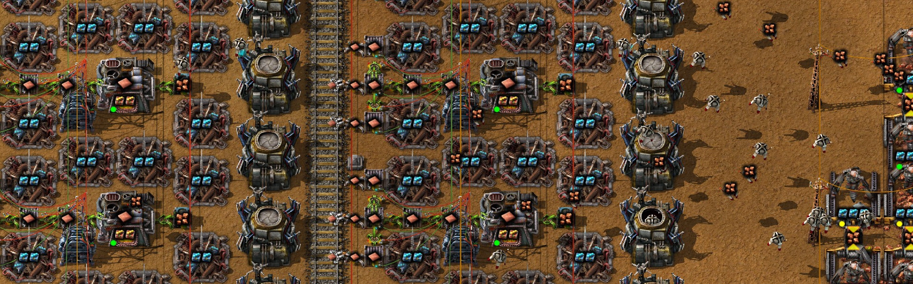

The scale of smelting needed to sustain a base of this size is substantial, and it's not long into the megabase stage before laying the belts and balancers of eight-beacon smelting arrays becomes an oppressive chore. (I know because I tried it for a while, hence the enormous number of blue belts languishing in mall storage). So to improve outpost setup speed, and because sheer scale means there is ultimately no escaping the visual and psychological repetitiveness of smelting by opting for eight beacons over twelve beacons anyway, I wanted a tileable twelve-beacon direct-insertion smelting design that could be repeatedly placed as easily as any production block. This implied an arrangement where load stations would be oriented vertically, tiled horizontally, and have identical circuitry to the load stations of the blocks themselves.

I personally dislike train-to-train smelting because I find dedicated ore trains annoying to set up, they require local fueling, and they typically need some active maintenance to compensate for the half-empty resource patches they leave behind; so instead I opted for a bot-fed design. As per largely standard twelve-beacon train-to-train arrangements, there is just enough space for a repeating twelve-beaconed smelter pattern to fit in a seven-tile-wide space, which can be placed directly alongside an arbitrary number of train wagons. However, the beacons in this design are offset an additional two tiles away from the tracks, which opened room for end products to be directly distributed between three chests per wagon, cutting train load times by up to two-thirds. (It also allowed the combinators to retain a near-identical physical placement compared to the blocks' load station design, which was the original impetus for this offset, because 1.1 doesn't maintain circuit wire connections when rearranging combinators). A layer of roboports near the outside requester chests brings the total tileable width to 20.

In addition to the usual medium power poles that join tiled train stations to each other, the smelter blueprint also includes power and circuit connections to a big power pole, which can be overlapped with big power poles along the rail network. Placing a new series of smelter stations along a straight shot of rail is thus a simple matter of selecting a location that lines up a big power pole, then clicking and dragging for as many stations as desired before finally joining the input rails. Since three stations tile exactly along the span of two big power poles while avoiding conflicts with rail placement, this can in theory extend infinitely - though in practice I have usually attempted to keep the number low to limit bot travel time.

The maximum train limit has been set to 2 - though in practice trains rarely stack behind any particular station, since each individual smelting station is slow, and overall throughput is thus maintained by the large quantity of stations. As with all load stations, smelter stations' combinators transform constant configuration and chest contents into train station limits, inserter filters, and global supply monitoring signals. However, as a UPS optimization, output inserters are additionally connected to the global red wire circuit network, which carries clocking signals generated at the main base. Detail on clocking is given under the [Monitoring and Clocking](<#Monitoring and Clocking>) section.

### Steel Smelting

8.04/s per station

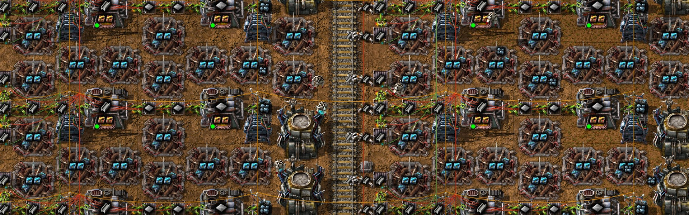

Similar in concept to plate/brick smelting, steel smelting stations are a two-stage direct insertion design, allowing iron ore to be converted directly into steel without needing to divert any iron plate trains. A ten-beaconed iron plate smelter just barely outpaces a twelve-beaconed steel smelter (4.275/s plates produced vs. 4.187/s consumed), so ten beacons are used for the first stage of smelters. This frees up space for pairs of roboports to be interwoven between pairs of beacons at the far edge of the build, keeping the total repeating station width down to 26 tiles. Placement of steel stations must therefore be done slightly more carefully than with plate/brick stations, as outgoing train tracks can conflict with power poles when tiled.

As with plate/brick smelting, steel station output inserters are also clocked. The iron plate smelting stage and the steel smelting stage each listen for separate clocks, timed to their respective stage's production rates. Again, detail on clocking is given under the [Monitoring and Clocking](<#Monitoring and Clocking>) section.

### Uranium Processing and Enrichment

3.953/s net U-238, plus 0.602/s net U-235

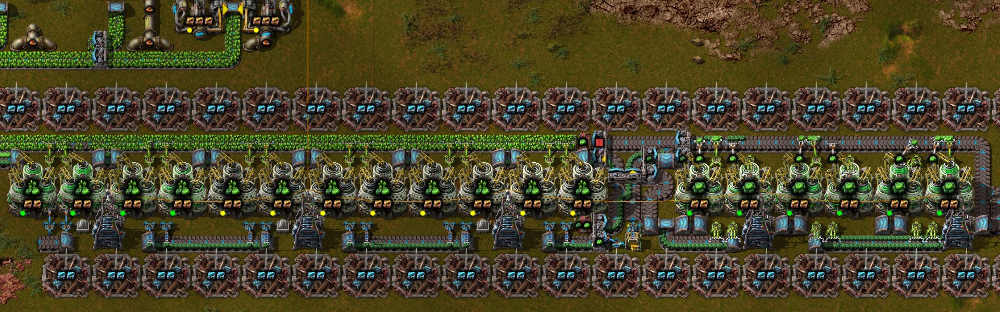

Designing an eight-beacon uranium processing setup is trivial. Designing an eight-beacon kovarex enrichment setup is a bit trickier. Designing both setups in such a way that the kovarex build can be built independently, but can also seamlessly attach to the processing build to increase U-235 output while maintaining the same interface... _that_ is a challenge.

The processing step is input bound, capable of consuming a full blue belt of uranium ore. The U-238 and U-235 products are dropped on the same lane, temporarily creating a [sushi belt](https://www.youtube.com/watch?v=6bRi1ykIeHg) that is initially sent backwards before being separated with a filtered splitter. U-235 is routed through a filtered storage chest, and is output back onto a belt only if the chest contains at least 100 U-235; this builds a cache to jump-start to future kovarex enrichment. (Because U-235 is placed back onto a parallel belt via an inserter, this blueprint cannot be flipped). The U-238 is sideloaded onto that same belt, giving each product a dedicated output lane. Both products then turn through [seemingly pointless splitters](https://i.kym-cdn.com/photos/images/original/001/264/842/220.webp), which each have one side filtered to a deconstruction planner, preventing any items from being sent down that path; it's not strictly _necessary,_ but marginally useful to avoid any potential "trapped" items during the earliest production stages, when U-235 in particular is very rare. Next, they turn and are sent underground between the uranium ore input belt and the centrifuges, and finally are filter-split again onto dedicated output belts.

When the kovarex enrichment build is attached at the rear, the routing is immediately altered. First, the circuit condition on the U-235 storage box's output inserter is overridden, eliminating the item requirement and immediately dumping all cached U-235 onto its output lane. This meets with the first of the originally pointless splitters, which has also had its settings overridden to now send priority output of both products back towards the kovarex enrichment. Any excess proceeds down the non-priority path and out of the build as before, ensuring that any excess of U-235 can't jam the build and halt production of U-238. The priority path immediately turns to meet a new filtered splitter. U-238 is sideloaded onto the far lane of what becomes the U-238 input belt for the kovarex centrifuges, while the U-235 is routed underground past that belt before reemerging at the rear, and then sideloading onto the far lane of what becomes the U-235 input _and_ output belt, which runs towards the front of the build.

The kovarex "loop" starts to become clear here. Each enrichment centrifuge has one output stack inserter that dumps both ingredients onto the forward-facing I/O belt, immediately followed by one input filter stack inserter that picks up only U-235 from that belt. All U-235 from both ore processing and enrichment itself is thus picked up by the first centrifuge in line that needs it, and any excess is simply passed to the next centrifuge down the line. If no centrifuge needs the U-235, it passes through and rejoins the non-priority output belt at the second of the originally pointless splitters, becoming the new U-235 output. U-238, meanwhile, is ignored by the filter stack inserters, temporarily creating another sushi belt before encountering the final filtered splitter of the build. This diverts and sideloads the excess U-238 onto the other lane of the same underground that the U-238 from processing was put onto, becoming the _near_ lane of the enrichment stage's U-238 input belt. Because inserters prioritize picking up items from the near lane of a belt, this effectively prioritizes reconsumption of U-238 from enrichment before consuming any fresh U-238 from processing, ensuring that the kovarex stage doesn't choke itself on its own U-238 output.

The number of enrichment centrifuges supportable with this design is technically bound by the _net output_ on the I/O belt, which could theoretically extend to as many as ninety centrifuges (0.094/s U-235 plus 0.157/s U-238 net per centrifuge). This is obviously (and hilariously) excessive, so the build is instead limited to a healthy six, whose _gross_ output is still comfortably within a blue lane (19.36/s U-235 plus 0.94/s U-238) and whose U-238 input is still comfortably supportable by the given processing centrifuges with plenty to spare for other purposes (5.363/s produced vs. 1.41/s consumed). Even six enrichment centrifuges is still excessive, producing U-235 at almost ten times the rate needed to keep all of ILLIAC VIII's 168 reactors fueled; it mostly exists to ensure the system doesn't get clogged by U-238.

## Intermediates

### Green Circuits (Electronic Circuits)

45/s * 8 rows * 9 blocks

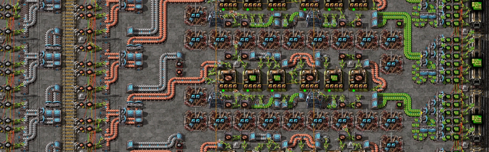

The first build in the base proper is an unusual one, as the combination of very high item throughput in a very small number of assemblers requires some unconventional design decisions.

Direct-feeding from copper wire assemblers to green circuit assemblers is a strict necessity within this footprint, but only one pair of assemblers can take advantage of the eight-beacon format's "free" tile for maximum compactness. However, this restriction can be circumvented by using three inserters and two steel chests in a U-turn (with each chest limited to one stack of items) to effectively direct-feed two immediately adjacent assemblers. Because the high volume of copper wire needed for each green circuit assembler requires two stack inserters to move, even when direct-fed, both copper wire-green circuit assembler pairs that use this technique have two such U-turn pairs, one on each side of the row.

A mere three green circuit assemblers with eight beacons each are needed to saturate a blue belt, but three copper wire assemblers with eight beacons each are just _barely_ not enough to feed those green circuit assemblers at a sufficient rate. Adding a ninth beacon to two of those copper wire assemblers is sufficient to solve this problem and saturate the belt. Some other builds you may see will add a ninth beacon to all three copper wire assemblers, but this is unnecessary, as two nine-beaconed assemblers combined overproduce enough to outweigh the underproduction of the third (2 * 15.4/s green circuits when fully fed vs. ~14.3733/s when restricted by an eight-beaconed copper wire assembler, for a total of 45.1733/s). To achieve this beacon coverage while maximizing overall compactness, the assembler order has been arranged so that copper wire assemblers are at the very front and rear of the assembler line, and an additional beacon is then placed on each end of the build, between the beacon rows and still within the rectangular bounds of their footprint.

Feeding these assemblers with sufficient input ingredients in such a small space quickly becomes an object lesson in [the nuances of inserter throughput.](https://wiki.factorio.com/Inserters#Belt_to_chest_(perpendicular)) The particulars are [complex and opaque,](https://forums.factorio.com/viewtopic.php?p=562244#p562244) but the short version of the relevant facts is this: An inserter can pick up many items per second when drawing from a curved belt that terminates at the inserter, a bit fewer when drawing from a perpendicular belt, and a bit fewer still when drawing from a perpendicular underground belt. The iron and copper inputs are arranged in slightly odd ways mostly because of these speed differences. The first copper wire assembler needs a second input inserter to sustain demand, and the first green circuit assembler must take iron from a standard belt rather than an underground belt. The second pair of assemblers need no special treatment since they each run at a slightly slower rate than the others, and the third pair draws their ingredients from curved belt ends.

Because three green circuit assemblers are tasked with saturating two lanes of items, the output of the first and third assemblers are each dedicated to an individual lane, while the output of the second (slowest) assembler is split evenly between the two. This is accomplished by placing one of its two output inserters on the _far_ side of the row, dropping its items onto an underground belt that crosses the row and returns to the near side; this then immediately sideloads onto another underground, effectively placing that inserter's contents on the near lane. That underground arrangement also enables the first assembler to sideload its own contents onto the near lane by diverting them upward and sideloading onto the row-crossing underground, thus merging the full output of the first assembler with half the output of the second assembler on the near lane of what becomes the final output belt. The third assembler's output is merged in a much more straightforward manner, simply being sent forwards in parallel on a separate belt and sideloading onto the far lane of the main output belt near the end of the build.

While this seemed a sufficient solution in theory, a problem arose in practice: small gaps would occasionally appear on the near lane of the output belt. The root cause was a common problem when trying to saturate belts, especially fast belts with productivity-moduled assemblers: small variances in timing mean that any given output inserter can be given inconsistent numbers of items at inconsistent times, which means the number of items being placed on the belt at any given time is also inconsistent. Ordinarily this problem is resolved with a subset of assemblers outputting onto a separate "buffer" belt and merging its contents with the rest by sideloading; as long as the buffer belt is of a sufficient length to contain a number of items greater than or equal to the maximum-sized gap that can be left by the other assemblers, the output lane is guaranteed to be saturated. This is the very technique used to saturate both output lanes in this build, and it works well on the far lane because its buffer belt is quite long. However, the buffer belt for the near lane is very short and cannot be extended, and the maximum-sized gap on the belt it sideloads onto is quite large.

The solution was to impose consistency onto the second circuit assembler by reducing both its output inserters' hand sizes; manual fine-tuning revealed the ideal size to be 4. This means the inserters swing more often but pick up fewer circuits, and thus the gaps left on the row-crossing underground are small and occur at relatively consistent intervals, which allows the buffer belt from the first circuit assembler to be much shorter without leaving gaps in the final output. In practice, it's not a _perfect_ solution - a tiny gap might sneak in every ten to twenty minutes or so - but at somewhere between four and five 9s of reliability, I feel comfortable calling that good enough.

At the block level, two safety features make their first appearance: the copper and iron stations are set to maintain two train loads worth of items rather than the typical one, and both items pass through a 1-1 lane balancer before being sent to their respective production row. See the [Solid Ingredient Stations](<#Solid Ingredient Stations>) section for details on why these features are necessary to sustain production using certain high-throughput items.

### Red Circuits (Advanced Circuits)

15.105/s * 8 rows * 6 blocks

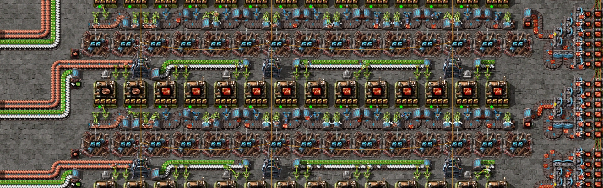

This is a very conventional build, much more reminiscent of what I would consider a default eight-beacon design.

Copper is first spun into copper wire, with each of the two assemblers capable of saturating a full blue lane. Wire output from the first assembler is sideloaded onto the near lane in a two-tile-wide space by use of an underground pair. To allow each assembler to saturate one lane in a very constrained space, the second of each pair of output inserters has their hand size overridden to 8, down from the maximum of 12. A default stack inserter outputting to a blue belt leaves an 8-item gap on the belt between swings, so if the second inserter only ever holds 8 items, it will always drop exactly the amount of items needed to fill that gap. This only works so long as the assembler being drawn from can consistently craft at least 22.5/s - otherwise, inserters will occasionally pick up fewer than their maximum set hand size per swing, desynchronizing them and causing them to leave variable-sized gaps on the belts. Since 22.5/s is an extremely high crafting speed, this technique cannot be used often.

The red circuit assemblers themselves introduce what will become a common belt design pattern, which I will refer to as dual-underground I/O. A line of assemblers in an eight-beacon design will often require four separate ingredients, or three ingredients with one requiring more than 22.5/s, which either way will use two full blue belts. In these cases, an output lane can still be constructed without belt weaving by building one of the input belts using underground pairs, and running a third belt directly next to the assemblers also using underground pairs; the space between these alternating undergrounds is used for output inserters, whose belts immediately curve towards the nearer undergrounds and sideload their items. This allows for up to 22.5/s output from up to 90/s input. Since this technique occupies all space on one side of a build, it requires power to be distributed via substations on the other side.

### Blue Circuits (Processing Units)

15.05/s * 8 rows * 1 block

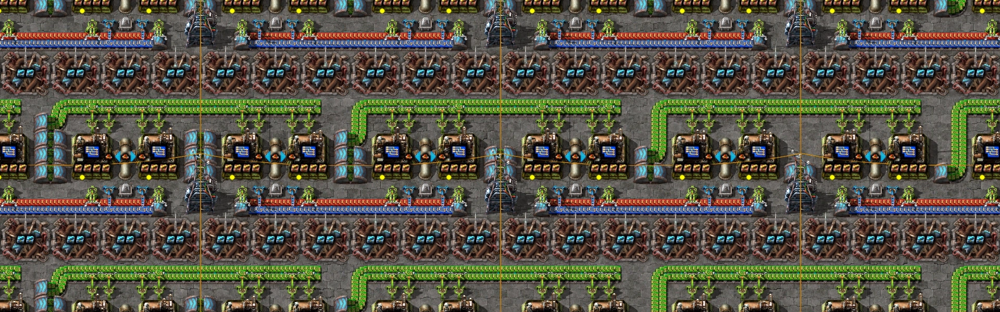

Blue circuits are notorious for their extremely high demand on green circuits, with each blue circuit assembler in an eight-beacon array capable of consuming a whopping 11/s green circuits on its own. But they also throw another wrench in the gears with the demand for sulfuric acid, which would be tolerable if blue circuits were built in chemical plants - but no, they're built in assemblers, which have a single immovable fluid input squarely in the middle of their three-tile width. This means a pipe cannot be run lengthwise down a contiguous array of assemblers in an eight-beacon design without blocking at least two tiles worth of inserter access per assembler on one side of a row. The longest contiguous design possible involves running underground pipes directly from the assemblers to a pipe laying outside the build entirely, but this prevents beacon sharing between more than two rows. One has little choice but to scrap such an idealistic plan and simply embrace gaps between assemblers to some extent or other. But such gaps must be managed carefully, lest assemblers align with their neighboring beacons and slow down. The ideal minimal gap arrangement, then, is either three tiles at a time, or an alternating one tile/two tile pattern.

The first key insight in this build is that, while the fluid inputs cannot be moved to the corners of an assembler, the assemblers themselves can be rotated. This allows for a fluid routing pattern where pairs of assemblers are separated by one tile, and sulfuric acid is routed by pipes running _between_ assemblers through those one-tile gaps. In this way, sulfuric acid can be run down the entire length while still allowing plenty of inserter clearance and beacon sharing in both directions, which is the technique used in the bus-based variation of this build included in my blueprint book.

However, because the actual demand for sulfuric acid is quite low, flow requirements do not strictly dictate a need for each row to have its own dedicated fluid input - so the variation of this build used in the production block opts for a simpler pipe arrangement. Each pair of assemblers has room between them for an input and output underground, which means a single input pipe can feed multiple adjoining rows from one side, with fluid flowing _across_ rows. This allows for beacon sharing only in one direction, but that's all that's needed for a block design anyway.

Having thus effectively decided on the alternating one tile/two tile gap pattern, this left the question of what, if anything, to do with the other two tiles. The second key insight in this build is that seven tiles of assembler and pipe space can be comfortably bridged by a blue underground pair, which conveniently allows for additional ingredient belts to run right down the middle of the build, _between_ the assembler pairs - a perfect solution for the oppressive green circuit demand. In fact, this design is so efficient at feeding in green circuits that the input constraint is actually _red_ circuits, consumed at 21.5/s per row. Although it would be physically possible to add a sixth belt of green circuits, it would not be physically possible to feed four more assemblers with red circuits.

One last bit of space efficiency can be squeezed out: because red circuit input and blue circuit output are both in quantities less than one blue lane per row, they can share a belt. Red circuit input is sideloaded onto the near lane, and blue circuits are dropped onto the far lane. The build terminates by sideloading this shared belt onto an underground to block only the red circuits.

Lane balancing the input green circuit belts upon unloading from each wagon is obviously necessary, but doing so with dedicated 1-1 balancers as in other blocks would be nigh impossible here given the need to also route so many belts through the same space. Instead, this block _starts_ by fanning out in the space between stations, and then lane balances all at once with a single 5-5 lane balancer for each row. (I found no premade 5-5 lane balancer, but Raynquist's 6-6 lane balancer had just enough room to add a loopback, transforming it into a 5-5 equivalent). After replacing the usual 1-6 balancer outputs at the end of the block with smaller 1-4s, there was _exactly_ enough room in the block to fit these 5-5 balancers, with one tile of vertical space remaining between them to route in red circuits. These balancers do arguably tarnish the otherwise quite elegant aesthetic of the builds themselves, but form must ultimately follow function.

### Oil to Petroleum and Rocket Fuel

(2,335.64/s peak petroleum * 4 double rows, plus 4.76/s rocket fuel * 8 rows) * 2 blocks

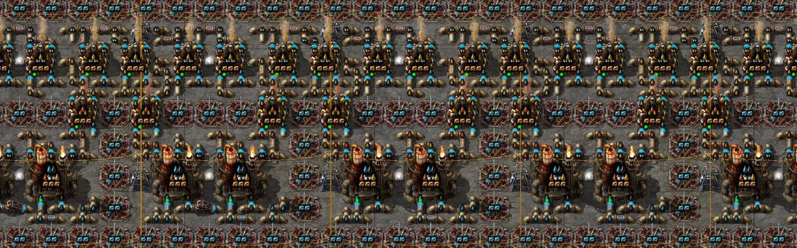

I wish I could say that I arrived at the beautiful (as fluids go), two-dimensionally tileable, and extremely compact oil processing solution showcased here through [a meticulous and carefully calculated process,](https://tenor.com/bmV1O.gif) but the truth is that I was throwing layout ideas at the wall to see what would stick and this mostly fell out on its own.

Most beaconed oil builds require their heavy oil to be sent across a line of beacons before it can be cracked. The idea of placing the heavy oil cracking plants closer to the refineries and have only one heavy oil pipeline was appealing, but I believed the obvious interference with beacons would clearly skew from ideal ratios - and how would the water be routed in anyway? But upon humoring myself, I discovered that surrounding a pair of refineries with beacons and pushing two cracking plants towards the sides results in a nearly perfect ratio (85.15/s heavy oil produced vs. 82/s consumed), the water can be quite easily shared with the water line to the refineries themselves, and the cracking plants can simply feed their light oil output directly into a pipeline running along the top of the beacons, which becomes the input pipeline for the light oil cracking plants.

But surely _those_ plants would have _their_ ratios skewed by the beacon interference of the heavy oil cracking plants - and how would the light oil or petroleum coming directly from the refineries be routed in anyway? Again I discovered that it all just so happens to work shockingly well. Four light oil cracking plants fit exactly in the repeating width of the refinery design, and in perfect symmetry with the refineries themselves, simply by using the standard one tile/two tile gap pattern necessary to maintain beacon alignment. When including the beacon interruptions created by the heavy oil cracking plants, the light oil cracking plants _also_ have a nearly perfect ratio with the rest of the system (233.2/s light oil produced vs. 228 consumed). Underground pipes have just enough length to let petroleum from the refineries reach the far side of the light oil cracking plants, allowing the creation of a shared petroleum output pipeline. Joining the refineries to the light oil pipeline gets a bit trickier, because the only place to join them coincides with the second light oil cracking plant's input, which in turn prevents that plant from directly joining the light oil pipeline. But as it happens, there's just enough space to wiggle an offshoot pipe between the first and second plants and then run it underground to meet with the input to the fourth plant, ultimately connecting it to the shared pipeline. And since the resulting repeating pattern is eighteen tiles wide with several two-tile openings, power can be distributed with a perfect substation grid, and lights run down the exact middle.

The feasible number of horizontal repetitions of this processing build is then dictated by 1.1's [fluid throughput limitations](https://wiki.factorio.com/Fluid_system#Pipelines) (which, again, will thankfully become [obsolete in 2.0](https://factorio.com/blog/post/fff-416)). Each pair of refineries consumes 262/s oil, and adding their respective heavy oil cracking plants totals 192.5/s water. So six builds remain just under the 1,200/s limit of a single offshore pump, while pushing oil demand to a high but still manageable 1,572/s. Twenty-four light oil cracking plants demand a bit more water than a single offshore pump can provide, but this is easily solved with a second such pump on the far end of the row nestled between the output tanks.

More concerning is the total petroleum output, which when joined with the refineries yields a peak of 384.9/s petroleum per build - a whopping 2,309.4/s in total, far more than one pipeline with so many branches can viably manage. However, there is enough room to run an additional pipeline directly next to the cracking plants. So the petroleum output of each build is split in half, with odd refineries and their nearest pair of light oil cracking plants sending their output down one pipe, and even refineries with their nearest cracking plants sending their output down a separate parallel pipe. These pipes end by jointly feeding into two neighboring tanks.

Cracking is circuit controlled for each row in a somewhat unconventional manner: rather than divert the flow of light oil away from cracking when it's needed, water is diverted instead. The dedicated offshore pumps feeding the light oil cracking plants are turned off (and the pump feeding light oil into its tank is turned on) if less than 10,000 units of light oil are present in the output tank. This avoids much more complex fluid routing by allowing all cracking plants to share a single contiguous light oil pipeline. Additional circuitry is not needed to restrict heavy oil cracking because lubricant is not produced here; while it is relatively trivial to meet demand by adding one lubricant plant to the end of each row (and alternate blueprints are included in the book that do this), I instead opted to add a separate coal liquefaction block and produce lubricant there.

The "raw" tile design contains additional flow-maintaining pumps for crude oil, light oil (including a circuit connection for a tank), and both petroleum pipelines, which would result in four pumps per tile - or 96 pumps per block just for the oil build itself. While a few of these pumps have been retained for flow rate reasons, most have been removed and strategically replaced with ordinary pipes to save some unnecessary game calculations.

The full row is capped off with a few additional beacons on each end near the light oil cracking plants to slightly even out the ratios, allowing for full heavy oil consumption, a bit more peak petroleum production, and only 20.82/s light oil overproduction - nothing strictly necessary, just cleaner math and bragging rights. On the bottom row of each block, bot-controlled production is also added for heavy oil barrels (to seed liquefaction) and flamethrower ammunition (because making it here was _significantly_ easier than adding an entire oil train station to a mall just to produce a single item in miniscule quantities).

Owing to the high oil demand (1,572/s per row, or 6,288/s per block), four chained fluid unload stations are used to bring in oil. Pairs of forward tanks from the final station are jointly used to feed each one of the four rows; each tank has its own pipe running towards the nearest oil pump until the last possible tile, where the two input pipes are finally joined. This effectively splits a single 1,572/s pipe (which could only run for six pipe segments before starting to lose flow rate) into two 786/s pipes for the majority of their lengths. On the output side, the dual parallel pipeline design must be maintained to feed the vast quantities of petroleum into the load stations, so each of the eight total petroleum output tanks have a dedicated connection to a corresponding staging tank in the first of four chained petroleum load stations.

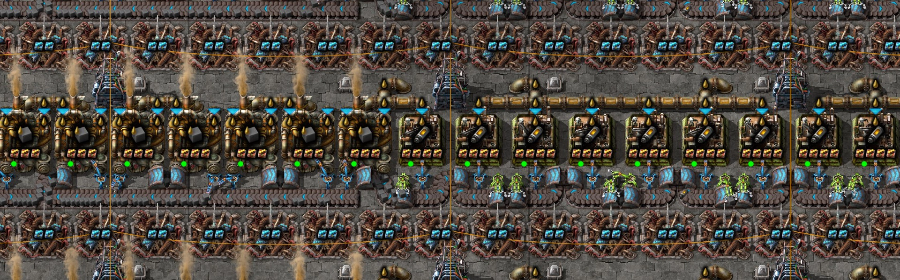

In an earlier version of this base, light oil was transferred to another set of fluid trains, where they unloaded into dedicated production blocks for rocket fuel - the only item in the game that _requires_ light oil. This obviously functioned, but eventually I decided that there is simply not much value in trains that only go from one type of block to one other type of block, and that train congestion could be reduced by simply not having light oil trains at all and instead making rocket fuel in the same block as the petroleum. So this block makes the unique choice of weaving its light oil outputs directly through and past the petroleum load stations, before merging into a unified light oil pipeline in a second, entirely separate production area dedicated to rocket fuel.

The rocket fuel build is the only build in the base that I designed to directly meet a production target at the row level, rather than my usual method of first optimizing a build for some ingredient throughput limitation and then simply accepting whatever overproduction might result when adding it to a block. I did this mostly because the addition of a second production area meant this particular block would already be quite long, and I wanted to ensure it would not grow any longer than necessary. 4.3/s rocket fuel per row is needed to meet white science demand, which requires four block segment widths for an eight-beacon rocket fuel design; the furthest such a design can easily be extended to produce more rocket fuel in the same number of block segments yields 4.76/s, a small but comfortable ~10.7% overproduction margin.

There was also just enough room to fit bot-controlled nuclear fuel production in the top and bottom rows, which take excess rocket fuel directly from the output belts and U-235 from the mall via logistics bots. Attempting to estimate exactly how much train fuel production might be needed for a base is an extremely imprecise exercise; train fuel consumption is based on time in flight, and is thus highly volatile with respect to network effects like pathing and congestion. Rather than even attempting such an intractable task, it is far easier and more helpful to simply look at real-world usage statistics, which in this case reveals an average base-wide nuclear fuel consumption of ~2.8/m. Since one centrifuge at the given speed in this build (2x prod 3's plus 3 beacons) produces 1.76/m, a mere two centrifuges are more than sufficient to sustain every train on the map.

Finally, the block ends with a loading station for rocket fuel followed by a light oil fueling station for defense trains. This station is always open (no circuit conditions) and simply takes light oil from the shared pipeline. While it seems a bit incongruous to attach a defense supply stop directly to a production block, it seemed much sillier to create a dedicated train to unload light oil in the defense mall and then immediately re-load that light oil into defense trains, so I judged this to be the least bad option.

### Coal Liquefaction to Petroleum and Lubricant

(930.5/s peak petroleum * 2 triple rows, plus 789.1/s lubricant * 1 triple row) * 1 block

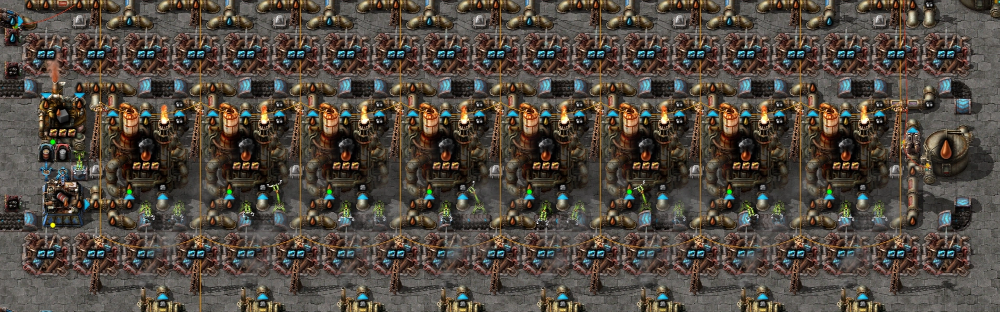

This is honestly here as a flex. The extra petroleum is completely unnecessary (though thankfully not _so_ abundant as to risk backing up petroleum in the oil blocks and choking rocket fuel), and sufficient lubricant production could be easily added to the oil blocks. I simply wanted to create an eight-beaconed liquefaction build as a challenge to myself, and I was surprised enough at the elegance of the result that I couldn't resist including it. Much like the oil build, it is little short of a miracle that the physical distribution of this build is so even - especially the power poles, spaced precisely six tiles apart horizontally with perfect vertical alignment across the entire build - but I'm certainly not complaining.

Steam is routed underground and outside the bottom-most beacon line entirely. Each refinery is fed by a dedicated boiler. Boilers overproduce steam by only ~8.11% (60/s production vs. 55.5/s consumption) - not enough for a smaller number of boilers to sufficiently feed the whole, so it's not worth building a shared steam line anyway. The far lane of the boiler's fuel belt contains solid fuel produced by excess heavy oil. Making solid fuel from light oil is technically more efficient, but 1) this greatly simplifies pipe routing, 2) this build produces some excess heavy oil anyway, and 3) efficiency doesn't really matter at such low production/consumption rates. The near lane of the fuel belt contains bot-fed wood. Kickstarting steam production for liquefaction is as good a use for excess wood as I've ever found, and it neatly avoids the requirement to manually insert fuel to start the process.

Eight refineries bordered by two lines of beacons can consume 88.8/s coal, just under two blue belts. One belt enters from the bottom to feed the first four refineries, and the other finds room by traveling along the top before curling around clockwise to feed the second set of four. Meanwhile, heavy oil is routed counterclockwise, feeding the solid fuel production and being fed by bot-carried barrels from the oil blocks before being reinserted into the refineries. Net excess ends up in a tank, which is pumped out to the next row of plants only if the tank contains at least 1,000 units of heavy oil, ensuring the production loop always has excess to sustain itself.

While game version 1.1 does not (natively) support fluid input/output location swapping, it turned out this was unnecessary to fully pack the next row with both lubricant and heavy oil cracking plants along with all their pipes. By simply interleaving the two, the cracking plants' heavy oil input can directly border a lubricant plants' heavy oil input, allowing them to share a single heavy oil pipeline with enough space left between to route water one tile down. Light oil, meanwhile, is routed underground from the refineries all the way to the output pipeline from the cracking plants, unifying the light oil line for further cracking.

Similar to the oil build, routing of heavy oil between lubricant and cracking is circuit-controlled, despite the shared pipeline. Heavy oil cracking plants have their water turned off unless the aforementioned heavy oil tank contains at least 2,000 units of fluid - meaning at least 1,000 units of excess heavy oil must accumulate before cracking is allowed. No such restriction is placed on lubricant, however, which effectively prioritizes lubricant over cracking. Its production is instead controlled by the pump to the lubricant tank, which is turned off when the tank contains at least 5,000 units of lubricant. Production is technically allowed after that point, but it quickly backs up and stops. This causes heavy oil to rapidly accumulate, and it soon passes the 2,000 tank unit threshold that activates heavy oil cracking.

Since the boilers are outside the last row of beacons, one liquefaction build is already unable to directly border another to share those beacons. This does have one fortunate side effect: the light oil cracking plants are no longer restricted from routing one of their input pipes outside the beacons as well. This allows the third row to be maximally packed with light oil cracking plants, just as the second row is maximally packed with heavy oil cracking and lubricant plants. Water is routed outside the beacons and given another dedicated offshore pump. Although there is space in the build to extend the light oil pipeline and add a tank, should one wish to extract light oil from liquefaction, this block design doesn't bother outputting light oil, so there's no need for a circuit restriction on the inputs for these light oil cracking plants. The required number of plants here does not occupy all available space in the row, so the build is finished off with a few extra lubricant plants.

Even the fourteen lubricant plants included in a single liquefaction build cannot consume all the heavy oil produced (607/s vs net 750.4/s) - and yet the base as a whole consumes nowhere close to the lubricant produced (165/s consumed for yellow science, plus 125/s maximum consumed in the mall for blue belts, vs. 789.1/s produced). Since any more lubricant would be a total waste, the lubricant production is included only in the second of the two liquefaction builds. This is separable by design; a liquefaction build without lubricant included will continue to work without any modification, since the circuitry controlling heavy oil cracking does not directly depend on lubricant. Coal input has then been given priority routing to the second build, so that demand from all wagons is kept even but lubricant production is still prioritized in the unlikely event of a coal shortage.

This is the only build in the base with a solid ingredient demand greater than 22.5/s that does not include lane balancers. Because half the coal is routed in backwards, the inserters effectively prioritize both lanes equally, since the far lane of a forwards-facing belt becomes the near lane of a backwards-facing belt. If this build produced solid ingredients, production stop-and-restart cycles could still gradually unbalance the system, since assemblers at the start of a row are the last to stop production when an output belt backs up and the first to restart as it empties (as is the case in the low density structures build). However, because this build produces only fluid ingredients, all refineries stop and restart effectively simultaneously, so this type of production restart cycling also cannot unbalance the system. The result is nearly perfect passively-balanced input ingredient draw from all chests. Sadly, this is the only build in the base where such a configuration is viable.

### Plastic

90/s * 8 rows * 3 blocks

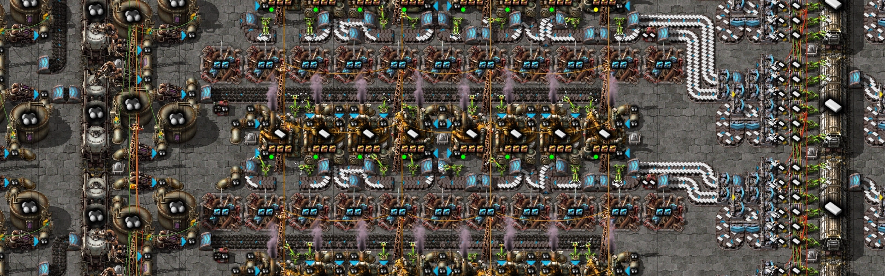

The key technique that allows a full 90/s plastic output per row is a variation of the sideloading introduced in the dual-underground I/O design pattern. Each pair of plants sideloads onto a shared pair of undergrounds that run directly alongside the plants to produce a gapless output lane. In the first two pairs of plants, the second pair actually sends their output backwards to sideload onto a third belt, which is then routed underground to the output using the space that would be taken by the input belt in the default I/O pattern (since it's unneeded here). The output of the third pair sideloads onto what becomes the near lane of the second output belt, which the last pair of assemblers then sideloads onto directly.

The sharp-eyed viewer may notice that these chemical plants are rotated in a seemingly odd pattern. While it is possible to fit the existing output belt arrangement next to a more typical row of plants (where all face the same way and the inserters and fluid inputs are compressed into one row of tiles, like the batteries build), what such an arrangement _doesn't_ leave room for in this case is power. By rotating some plants to the front and back, and taking advantage of the free tile precisely in the middle, just enough space is freed on both sides of the build to add a perfectly symmetrical, eye-pleasing set of medium power poles. Lights are then placed along the middle of the build beside every four plants.

Because of the high petroleum requirement (about 5,539/s) needed to sustain 720/s plastic output, three chained fluid input stations are used and each row is given its own input pipeline from a dedicated forward tank. Only one coal stop fits in the space remaining, so it has been set to maintain two trains worth of item buffer rather than the usual one.

One block is _barely_ not enough to sustain 2700/m science (720/s plastic produced vs. ~731.25/s consumed), so three blocks are needed even though their combined production is significantly higher than necessary.

### Sulfur and Sulfuric Acid

(90/s peak sulfur * 2 rows, plus 1,170.2/s sulfuric acid * 2 rows) * 1 block

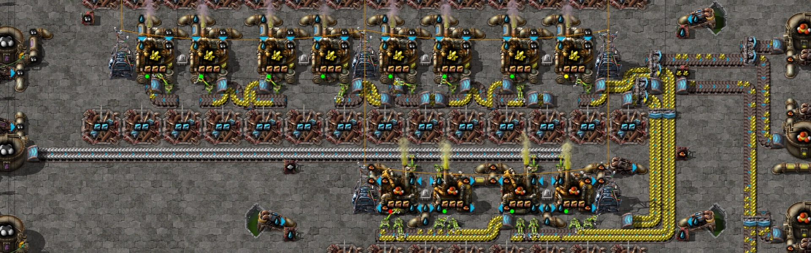

Sulfur and sulfuric acid are needed in such small quantities even at typical megabase scale that it feels wasteful dedicating an entire block-sized area to each of them. Owing to their semantic and ingredient similarities, I decided to instead combine them into a single block.

The sulfur build uses the exact same system of sideloads that the plastic build uses to again create a gapless 90/s output. The belts are spaced farther apart than on the plastic build, owing to the familiar one tile/two tile gap between chemical plants necessarily arising from the two fluid inputs. The major deviation from plastic is at the output, where splitters divert to either the neighboring sulfuric acid builds or to the sulfur load train station. Splitter priority is given to the acid builds, ensuring maximum peak acid throughput. Sulfur builds are much longer than acid builds, so those neighbor each other to minimize total beacon usage within the block.

### Batteries

22.5/s * 4 rows * 1 block

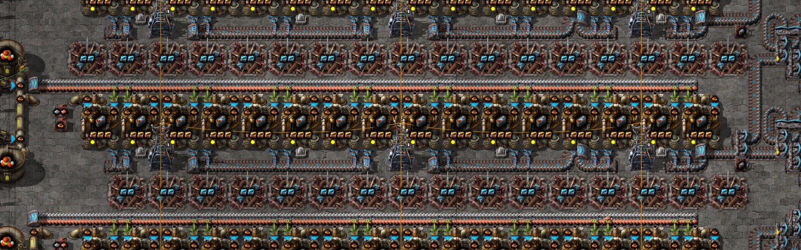

A very straightforward build. Alternating sulfuric acid pipes and input inserters are packed into one side of the row, so substations are placed on the output side.

### Solar and Accumulators

(4.5/s solar * 4 rows, plus 9/s accumulators * 2 rows) * 1 block

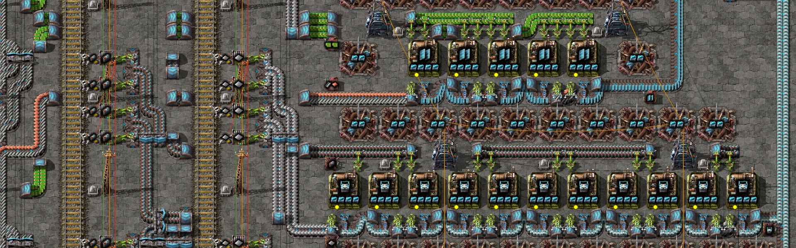

Similar to sulfur and sulfuric acid, solar panels and accumulators are needed in relatively small quantities, and make sense to build together. Unlike sulfur and sulfuric acid, however, this has to do with how they're used rather than how they're made, as they're needed together for science and power generation alike. For this reason, this hybrid block outputs to a shared train, which travels only to the white (space) science block and back. In theory, solar and accumulator production could be bundled into that block to avoid the need for such a train (and it could share the green circuit and iron lines with the satellite's radar production), but belting would likely be quite messy, and a single point-to-point train isn't the end of the world.

Routing of ingredients is obviously abnormal here, mostly because solar and accumulators don't share any; the more interesting features, however, are on the other end. The output belts feed into passive provider (red) chests before being immediately removed and reinserted into plain steel chests, which then feed the train as usual. This system effectively prioritizes output to the train (and therefore science) so only excess production is made available for base building. Filter stack inserters are disconnected from the usual train station constant combinator and instead set manually because the stack variant of filter inserters cannot accept more than one filter, so connecting them both to a single combinator with two signals would cause only half the inserters to function.

### Rocket Control Units

6.3/s * 8 rows * 2 blocks

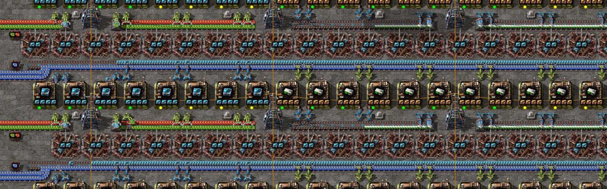

The RCU build was originally designed to be input bound, and as such has a total production capacity a bit over 50% higher than needed. I left it as is to maintain the perfect ratios (module assemblers consume exactly 22.5/s green+red circuits and produce exactly 4.5/s; RCU assemblers then consume exactly 4.5/s modules and produce exactly 6.3/s) and also because I simply didn't feel like redoing it just for more "ideal" production rates. The given amount of overproduction does mean that, should one wish to double science capacity again and reach 10.8k/m, only three RCU blocks would be needed rather than four, but that was a happy accident of the math and I don't intend to push the base to that point anyway.

Power substations were placed on the bottom of the row rather than the usual top because there was a natural gap between the green+red input belt and the RCU output belt, which also happened to coincide with an ideal placement for a substation in a perfectly spaced array, so it simply felt _correct_ there.

### Low Density Structures

6.3/s * 8 rows * 3 blocks

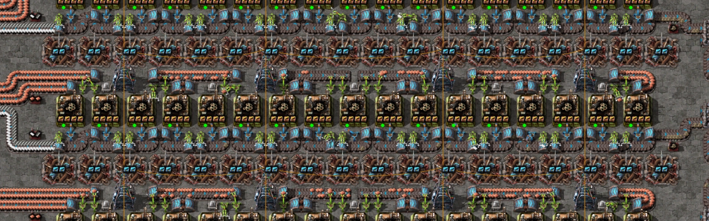

The math of this LDS build works out such that potential consumption by the assemblers is exactly 1/90th higher than what can be supported by belts (91/s potential copper consumption vs. 90/s actual on two blue belts; 22.75/s potential plastic consumption vs. 22.5/s actual on one blue lane), so occasional assembler stoppages owing to item ingredient shortages is to be expected, and indeed is preferable over a lower-output alternative. However, because this production is spread over 17 assemblers in each row, one cannot dedicate each of two input belts of copper to exactly half the assemblers. So this build routes the second copper belt all the way to the back of the build before curling it around and running it _backwards_ to feed the rear half of the assemblers; the assembler in the exact middle is then fed with two inserters, one dedicated to the end of each of the two belts.

At the block level, as with most high-demand solid ingredients, both copper input stations are set to maintain a two-train item buffer over the usual one. On the output end, there was room to fit two output train stations, which helps maintain train throughput to yellow and white science's chained solid ingredient unload stations.

## Science

### Red (Automation)

22.5/s * 4 rows

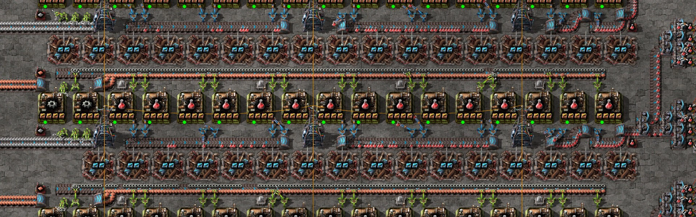

No noteworthy techniques to mention here that haven't already been mentioned in other builds.

### Green (Logistic)

22.5/s * 4 rows

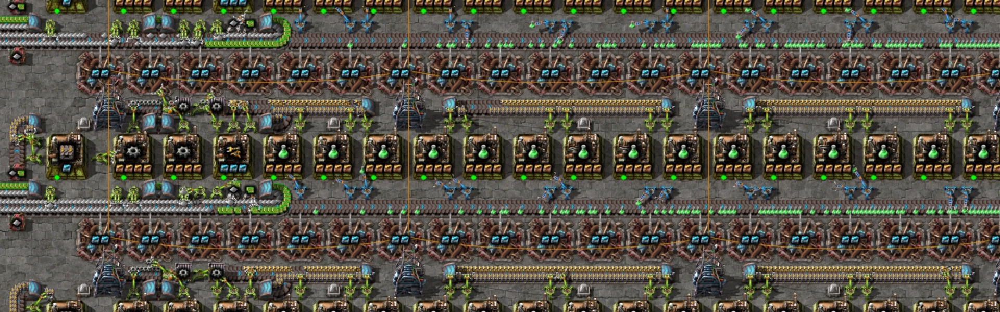

Several tricks combine to create the leading belt and inserter section with four functionally gapless assemblers - the most complex of which is gear distribution. The _combined_ output of the two gear assemblers is sufficient to feed the belt and inserter assemblers at the necessary production rates, but even fully beaconed, the second gear assembler _on its own_ is insufficient to feed the inserter assembler. Therefore, the output of the first gear assembler is partially redirected to contribute to the output of the second.

As with the green circuit build, this gear output is "direct"-fed via a chest U-turn for throughput reasons, so both gear assemblers feed into the first of the chests. However, the combined output must still prioritize gears from the second assembler, since the first one must direct the majority of its output to belt creation. This prioritization problem was solved by placing a circuit restriction on the first assembler's addition: Though the chest it feeds can hold 100 items, the first assembler only contributes if the chest holds fewer than 50 items. By doing this, the second assembler feeds the chest as fast as it is able, and the first assembler adds to the total only when the second falls behind demand.

Meanwhile, the inserter assembler is so fast that it requires three input inserters to fully feed it with iron plates and green circuits, evenly split between the two. However, testing showed that three naive inserters would often all try to pick up the same ingredient at the same time, competing with each other for one ingredient and ironically starving the assembler of the other. So the first two are each filtered to opposite items, preventing competition with each other; the last one automatically alternates between the remaining items as needed. (Note the dedicated input belt is routed underground before curving backwards to fit in the space.)

### Black (Military)

11.25/s * 8 rows

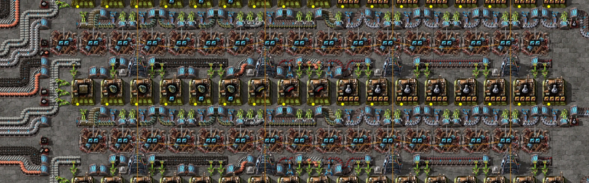

Though it goes mostly unused, I did want to do a bit of infinite military research (and also simply to say that I built it!). The only belt technique much worth noting here is at the very beginning: While the grenade assemblers output onto the far lane in the by-now-familiar dual-underground I/O design pattern, the wall assembler outputs onto the near lane of that same belt by jointly sideloading with the first grenade assembler just before the I/O pattern begins.

### Blue (Chemical)

11.25/s * 8 rows

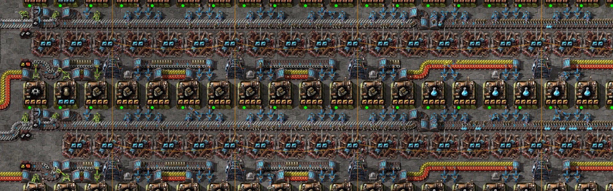

Mostly unremarkable, with the possible exception of a filtered splitter to take a shared iron-steel input belt and sideload only the steel onto the near lane for clean engine production. This obviously could have been done without a splitter by using separate input belts, but since much less than one lane of each ingredient is actually needed, the splitter solution allowed for two input belts instead of three, simplifying fanout for the block. (This problem also could have been solved by mandating specific _lanes_ for iron and steel, but I personally believe that sort of mandate isn't obvious enough to be user-friendly).

### Purple (Production)

5.625/s * 8 rows * 2 blocks

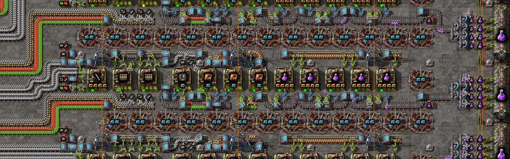

The first significant break from normalcy in the science builds. Input demand, especially rail intermediate demand, is so resource-intensive that there simply isn't room in an 8-beacon design to fit the belts required to reach the 11.25/s minimum of all other science builds; instead, exactly half that output is targeted and the total output is split across two blocks.

This build uses a wide array of belt and inserter trickery to achieve maximum 8-beacon compactness. The key insight that shaved the assembler gap to only the single "free" tile was to direct the output of each rail assembler onto entirely separate belts, rather than ultimately merging them onto opposite lanes of a single belt (which can be done, but every solution variant I could find required more space). This ultimately creates two input ingredient belts - one containing modules and half of the rails, the other containing furnaces and the other half of the rails.

Iron stick output inserters needed to nearly, but not quite, saturate their lane; only 20.09/s need to be produced to feed rails. Because of this, the 12-8 hand size override trick used in the red circuit build (and again here on the rail assemblers) would result in the stick output inserters taking fewer items than expected, breaking their synchronization and creating unintentionally large item gaps. Experimentation found that an 11-7 override slowed the inserters just enough to roughly match stick production rate, and thus minimized gaps consistently enough to keep the rail assemblers fed. Sticks are then sideloaded onto a near lane, which both rail assemblers draw from; their stick input inserters are separated by two tiles, so each assembler can draw from a buffer of at least 12 sticks on the belt. This buffer is needed so the second assembler is never starved for sticks because the first assembler took too many at an inconvenient time.

The first rail assembler outputs onto the far lane of _the same stick belt,_ avoiding the need for a dedicated output belt. This then dips underground to give the second rail assembler room to output onto its own separate belt. This second rail belt immediately sideloads onto an underground that carries its output to the opposite side of the row. There it is met by the furnace output, where both rails and furnaces sideload onto a new underground to create the second science input belt. Meanwhile, the first rail belt comes above ground again and immediately sideloads itself onto two more undergrounds, which blocks the remaining sticks and clears the near lane for modules.

Modules are carried from each of their assemblers towards the first rail belt in their own unique way, but end up merging with the rails in the same place. The first assembler outputs onto an underground that crosses to the other side of the row and joins with the second of the stick-blocking underground pair. Since inserters that output onto a parallel-facing belt will always output on the right-hand side in the direction of travel, these modules are output directly onto the right-hand (clear) lane. The second assembler outputs to a backward-facing belt, which immediately sideloads and lane-swaps onto the same underground as the first assembler. Finally, the third assembler has no room whatsoever to output on the same side of the row as the other two; instead, it outputs above, sideloading to take a circuitous path backwards and underground before sideloading its output a second time, this time again onto the second of the stick-blocking underground pair.

### Yellow (Utility)

22.5/s * 4 double rows

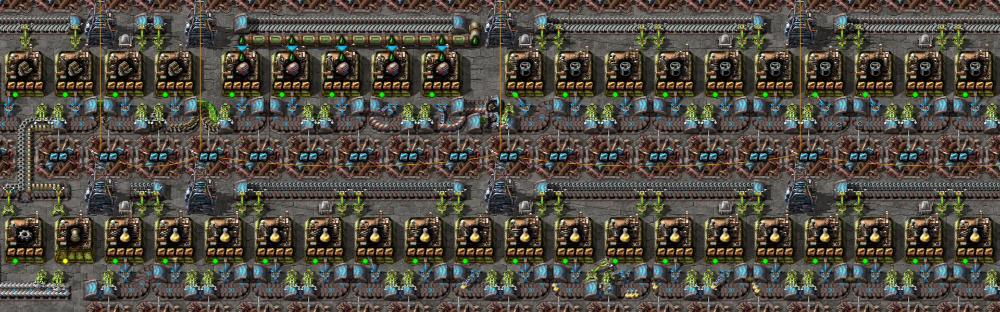

While it is technically possible to achieve 11.25/s yellow science output in a single 8-beacon row, the result is both inefficient (in terms of intermediate overproduction and beacon requirements) and also, frankly, quite ugly. Instead, this more elegant design spans across two rows each, with robot frames mostly produced in one row and the science itself produced in the other. Because the beacons required vary so greatly between the two rows, this build is also flipped every other instance, mirroring its neighbors for optimal beacon sharing.

Besides the obvious uniqueness of intermediates crossing between rows, the noteworthy belt feature here is a filter splitter which transforms the electric engine input belt (consisting of green circuits and engine units) into a robot frame input belt (consisting of green circuits and electric engines). Since the engine units and electric engines are both on the far lanes of their respective neighboring belts, a splitter filtered to engine units actually _swaps_ the engine unit and electric engine lanes in-place, while leaving the green circuit lane entirely untouched - blocking one item and replacing it with another in the length of a single tile. This was definitely one of my brain's finer moments.

This block is the first of two (the other being white science) to feature chained solid ingredient unload stations, in this case for low density structures.

### White (Space)

22.5/s * 4 rows

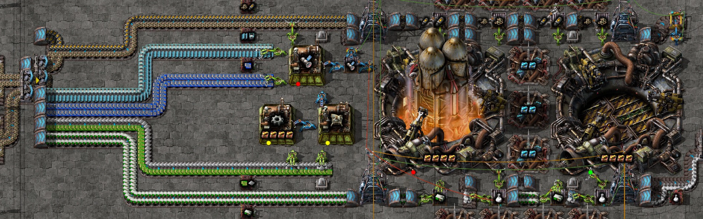

Rocket silos have very distinct behavior, so the white science build must be similarly distinct.

An individual rocket silo at 4.9x crafting speed, which is capable of outputting an amortized 11.25/s white science, requires each of its three main ingredients to be input faster than a single stack inserter is capable of providing from a belt - but only while actually crafting rocket parts. During the routine downtime of the launching animation, or merely while waiting for an output cache of science to fall below 1000, the silo consumes nothing at all. (This behavior [will change in 2.0](https://www.factorio.com/blog/post/fff-405)). Rather than risk inconsistencies from a multiple input inserter design, this build instead uses inserters to transfer the requisite items into steel chests at belt pace, and then direct insert from the steel chests into the silo when needed, effectively creating an input buffer.

The output inserter from the front silo's science chest, if left on default settings, would empty the chest faster than another rocket could launch. This inserter has therefore its hand size overridden to 8, forcing it to swing more often and thus effectively slowing down its output rate. This helps it keep pace with production speed and roughly match the speed of the rear silo.

Only the front silo has room to receive a direct satellite insertion; the rear silo is fed satellites from a belt. To avoid overproducing and saturating this belt, satellites are only dropped onto the belt if the last belt segment has no satellites on it. However, since belts have travel time, up to 10 satellites can be placed on an empty blue belt of this length before any can reach the end and trigger the stop condition. Therefore, to maintain a sufficient reserve, the satellite output chest is restricted to 12 slots - 1 for the front silo, 10 for the rear silo, and an additional 1 for safety.

Like yellow science, this block features chained solid ingredient unload stations, this time for LDSs, RCUs, _and_ rocket fuel. While this extends the total width of the science block by a full segment, parallelization is essential to prevent potential disruptions to the flow of these three items, which all suffer from high demand and low stack size.

Although white science itself has a stack size of 2000, all relevant train and station conditions are set to act as though its stack size matches the other sciences' 200, to prevent an absurdly large and expensive buffer from piling up.

### Labs

~5.62325/s * 8 rows * 2 blocks

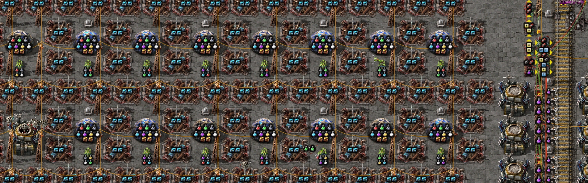

Because I included a black science capability, and because I am personally averse to belt weaving, there was little incentive to _not_ turn the research labs into a bot-fed 12-beacon design. Splitting the total lab capacity required for 5400/m science across two blocks struck the best balance between high per-block research capacity and low per-block bot travel time.

Each block uses a dedicated bot network to avoid player-driven bot demand or network inefficiencies causing research interruptions; roboports around the perimeter of the research blocks have therefore been removed. This in turn restricts the main network from providing fuel to some trains in some neighboring blocks. When choosing which blocks would border the labs, care was taken to ensure that no train schedule had both load AND unload stations affected by this restriction, so all trains are guaranteed at most one stop without refueling capability, regardless of which particular path they ever happen to take. Labs were also placed at the corners of the base to minimize the total number of blocks that were fuel-restricted in this way.

Frustratingly, owing to labs being influenced by speed research and productivity modules (both understood to be a given at megabase scale), it is mathematically impossible for any vanilla lab setup to consume a quantity of blue lanes of science that is both exact (down to the last decimal place) _and_ reasonable (i.e. achievable without the use of [Clusterio](https://github.com/clusterio/clusterio) and [an army](https://www.pcgamer.com/games/survival-crafting/factorio-world-record-server-god-factory/)). Rather than consuming at a slightly higher rate than production for the sake of hitting the exact target number - and gradually running down any science buffer in the process - this design instead uses the Price is Right principle, consuming as close to the production target as possible without going over, which lets us hit ~44.99/s/block, or ~5,398.8/m. Happily, this target resulted in a beautifully symmetrical beacon design which fits exactly in a five-segment-wide block along with the seven train stations.

## Other

### Speed and Productivity Modules

(0.3456/s speed tier 3 * 1 row, plus 0.3456/s productivity tier 3 * 1 row) * 1 block

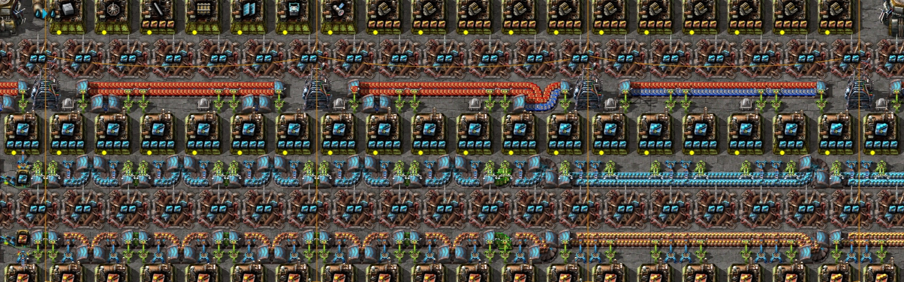

Especially during the early megabase stages, growth is fundamentally bottlenecked by module production speed, so it makes sense to have a "proper" build for modules instead of relying on solitary bot-fed assemblers - and it also makes sense to place those module builds in the mall, since the player is their consumer.

Filtered storage (yellow) chests have been added to buffer a small number of tier 1 modules for other blueprints or mall recipes that might need them (e.g. speed tier 1 -> RCUs -> nukes), avoiding the need to make those separately. There are also chests that take any spare tier 2 modules laying around and insert them directly into a tier 3 assembler for automatic reprocessing. (Because tier 2 and 3 modules require the same circuit ingredients, there's simply not much point to actually using tier 2s unless specifically needed for some obscure production ratio).

### Mall

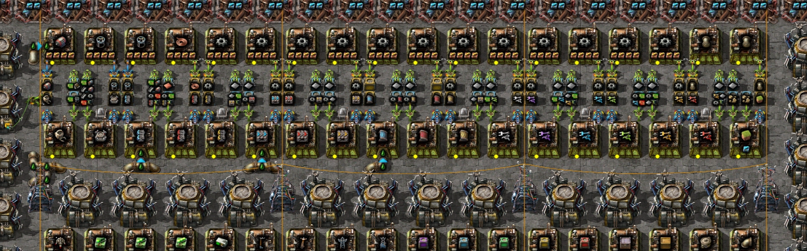

By placing the aforementioned module builds in the center of the mall, the outside beacons can be used to accelerate crafting of major intermediate ingredients (primarily gears and engines) that could otherwise bottleneck several other items of high importance. Care has been taken to group related items near their intermediates and near each other, both to minimize bot travel time and for easier manual browsing.

Unlike most other malls, production is not limited based on circuit conditions or blocking chest slots. Instead, output inserters are restricted by _total contents of the logistics network,_ which limits production even if excess items aren't specifically placed in their source chest. This also allows for higher overall item limits than could fit in a single chest, again helpful for things like gears. Additionally, assemblers output not to passive provider (red) chests but storage (yellow) chests, filtered to the relevant item type. This allows bots returning items to the mall (e.g. after deconstruction) to prioritize their source chest, which helps keep things generally clean and tidy. 

Bots themselves are fed from their output chests directly into a neighboring roboport when the respective available bot count drops to zero. This helps ensure the main network is as populated as it needs to be to handle the biggest project it's ever been given, but no more so.

Trains are arranged with circuit stations on one end of the block to feed module production (plus the lubricant train for blue belts and electric engines) and all other ingredients on the other end, arranged roughly so that items in higher demand are closer to the assemblers. Circuit stations are constructed just like all other bot stations in the block, using passive provider chests as an item buffer rather than the usual steel chests so their circuits can be used for production of both modules and everything else. And again, station combinators have been modified so trains are only called when ingredients have run out entirely (see [Station Circuit Control](<#Station Circuit Control>) section for more details).

### Defense Mall

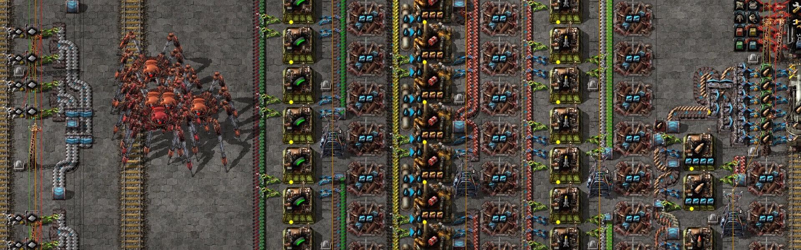

While the primary mall does contain a comprehensive array of defense production, it's mainly there for player armament and experimentation; automated defense at megabase scale requires more production than that. So I created a separate mall to mass-produce my ammunitions of choice, to be picked up by a dedicated anti-biter spidertron army and by the defense trains that keep the walls supplied.

The high number of different input and output ingredients, plus the relatively low output volume, led to a bus-within-a-block design. Singular, vertically-oriented production "rows" draw from a bus of one ingredient per belt that runs along the bottom of the block. Outputs are fed into buffer chests so they can also draw from the ammunition created in the main mall if that happens to overproduce or if returned items happen to get filtered there by bots. The single train stop is always open, with chests dedicated to individual item types that fill filtered slots in the wagons.

The quantity of beacons here is certainly overkill for the amount of production that's actually needed - but hey, this is defense. There's no kill like overkill!

### Landfill

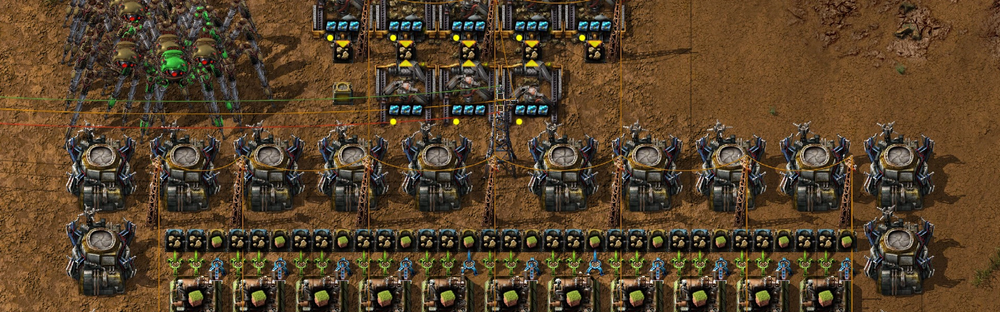

Every body of water within the base's defensive border has been completely landfilled, despite the cost to pollution spread, simply because it is extremely annoying to be forced to manually chart a path and queue up spidertron move commands just to travel to mining outposts and back. (The Spidertron Enhancements mod does allow spidertrons to hook into the engine's pathfinding, but this is unfortunately unreliable, as it will skirt relatively close to lake edges where individual spidertrons can easily get caught, especially if any are moving slower than their group).

Due to extremely high stone requirements, this task requires more landfill than a single mall assembler is capable of sustaining. A dedicated stone patch and bot-based landfill production area was therefore established just to the base's east, along with a spidertron group dedicated solely to landfill tasks.

### Monitoring and Clocking

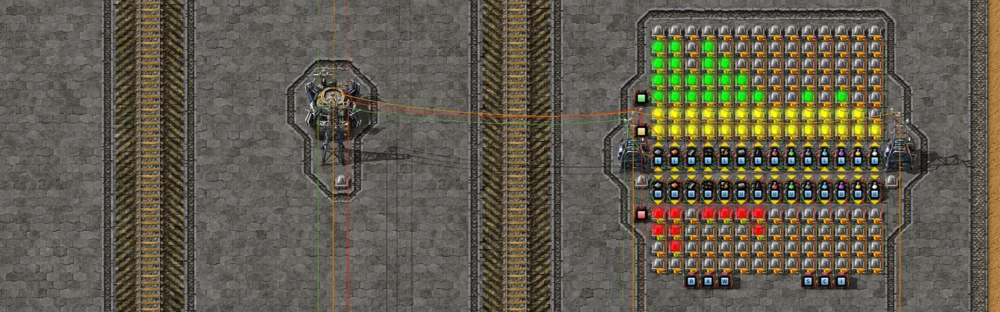

The lower-right hand corner of the base contains a basic visual display of supply and demand, as determined by the train station combinators that broadcast on the global circuit network. The top section shows the seven "raw" ingredients (defined as both raw and post-smelted items - iron plates, copper plates, steel, coal, stone, stone bricks, and crude oil) and the seven sciences, while the bottom section shows the fourteen "intermediate" ingredients (defined as anything else carried by train, in order of appearance within the game menus except with liquids moved to the end - solar/accumulators, plastic, sulfur, batteries, each type of circuit, RCUs, LDSs, rocket fuel, U-235/U-238, petroleum, sulfuric acid, and lubricant).

The vertical axis represents the number of whole train loads ready to be picked up from load stations (positive) versus the number of whole loads demanded by unload stations (negative). It does not account for partial loads or train contents, so the actual quantity of items in the supply pipeline is higher and thus safer than what is strictly shown here. The axis is on a logarithmic scale - so the lights closest to the combinators represent one load, the next closest represents two loads, then four, eight, and so on.

Between these two monitoring displays lies the [inserter clocks.](https://www.youtube.com/watch?v=FLb8TJ6-Z2M&t=1622s) Plate/brick smelter output inserters activate with the `C` signal, timed to the production speed of a twelve-beaconed plate furnace (hence `C` - hex 12); the signal value is then transformed to be either 1, 2, or 3, which allows the three-chest distribution inserters at the smelting stations to spread contents evenly between the chests by triggering only for specific values. Steel smelter output inserters use two separate clocks, tuned to the production rates of the two separate smelting stages. The ten-beaconed plate inserters activate with the `A` signal (hex 10), paying no attention to the specific value as it feeds only into the next stage and thus does not need to care about distribution. The twelve-beaconed steel inserters activate with `S` (for steel, as `C` was taken), which is also transformed to be 1, 2, or 3 for the same reasons.

### Nameplate

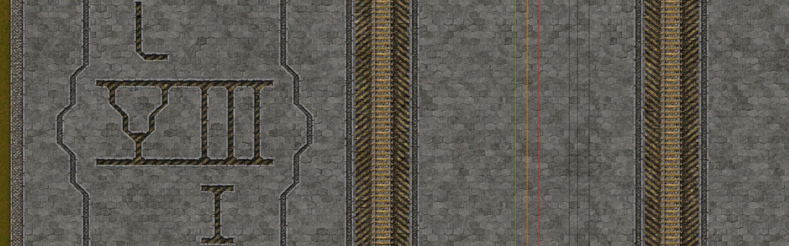

In the upper-left hand corner, exactly opposite the monitoring display and clocks, is a simple concrete nameplate. The use of hazard concrete for the lettering makes little difference from the normal camera, but allows it to show as bright yellow from the map view. The plate's size and shape is exactly the same as the monitoring display, and the necessary 3x5 lettering and extra space for legible roman numerals happen to exactly fit in the space of the display's stone brick outline. A symmetrical christening seemed a fitting way to top everything off!

